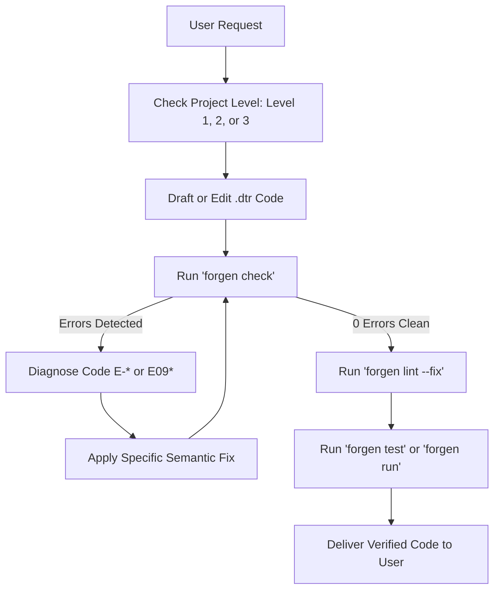

# Datara AI Agent Rules & Decision Framework

This document defines the strict, non-negotiable behavior rules, code inspection workflow, and recovery protocols for an AI assistant working on Datara codebases.

---

## 1. Autonomous Agent Execution Loop

Whenever a user requests Datara code creation, bug fixing, or refactoring:

---

## 2. Invariant Code Generation Rules

### Variable Declarations
- Default to `let name: Type = value` for immutable bindings.
- Only use `mut name: Type = value` if the variable is modified later in its scope.
- If unsure of type during prototyping, use `val name = value`.
- **FORBIDDEN**: Never emit `:=`.

### Strings
- If printing plain text: `"Hello World"`
- If embedding variables: `fmt"Total: {total}, Status: {status}"`
- **FORBIDDEN**: Never write `"Total: {total}"` expecting interpolation.

### Control Flow
- Prefer `for i in 0..N` over `while` loops with counter increments.
- Write explicit conditions in `if`: `if count > 0` (never `if count`).
- Avoid `if cond == true`; write `if cond`.
- Match exhaustively: always provide `_ => ...` wildcard when matching enums if not all variants are explicitly covered.

### Division and Arithmetic (`E0941`)
- Before dividing `a / b`, ensure `b` is proven non-zero:
  - Option A: Contract `require b != 0, "Non-zero divisor required"`
  - Option B: Guarded block `if b != 0 { return a / b }`
  - Option C: NonZero refinement type.

### Security and I/O (`E0940`)
- When writing entry points performing I/O:
  `fn main(sys_caps: SystemCapabilities)`
- Pass `Capability<FileRead>` or `Capability<FileWrite>` down to helper functions.

### Multi-Threading (`E0943`)
- Inside `parallel for i in 0..N`, all mutated variables must be local inside the loop body.

---

## 3. Verification Protocol

Before declaring any task complete:
1. Run `target/release/forgen.exe check <target>`:
   Must report `[Forgen check] Verified 100% OK (0 errors, valid ownership & effects)`.
2. Run `target/release/forgen.exe lint <target>`:
   Must report `Clean! 0 warnings` (or auto-fix with `--fix`).
3. If integration tests exist:
   Run `target/release/forgen.exe test <target>`:
   Must report `test result: ok. N passed; 0 failed`.
