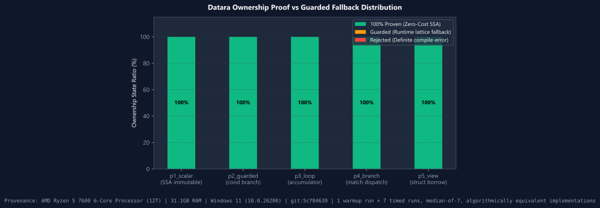
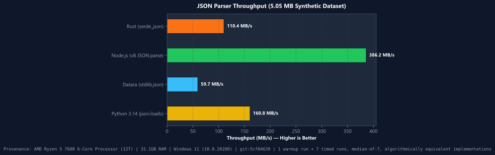
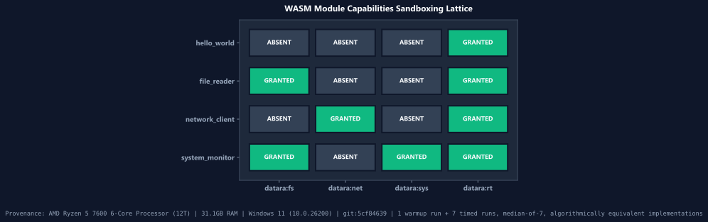
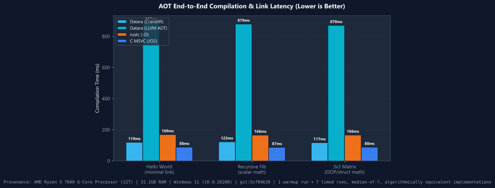
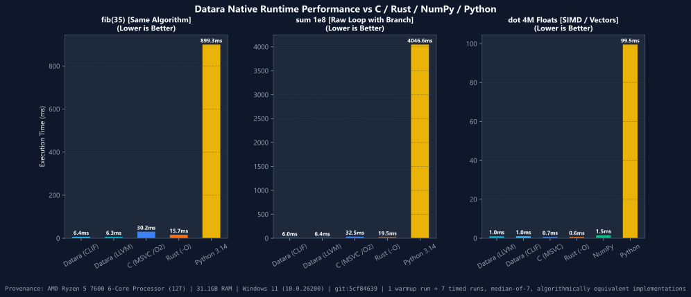
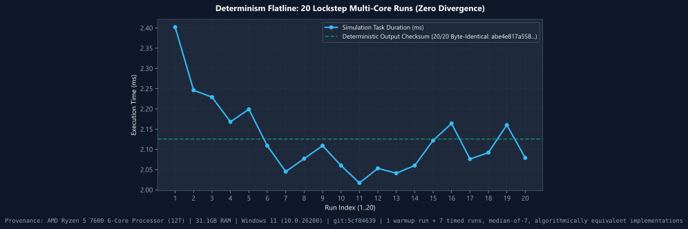
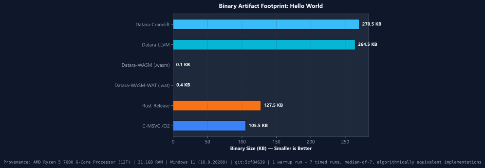
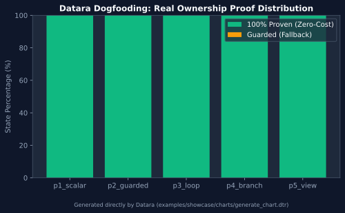

<p align="center">
  
</p>

# Datara: Высокопроизводительный язык системного и прикладного программирования

<p align="center">
  <a href="https://github.com/datara-lang/datara"></a>
  <a href="LICENSE-APACHE"></a>
  
  <a href="https://github.com/datara-lang/datara/actions/workflows/ci.yml"></a>
  
  <a href="docs/CONFORMANCE_MATRIX.md"></a>
  
  
  
  
</p>

<p align="center">
  <a href="#1-установка-и-настройка"><b>Быстрый старт за 60 секунд</b></a> &bull;
  <a href="#2-полное-руководство-по-синтаксису-и-мастерству-языка"><b>Руководство по синтаксису</b></a> &bull;
  <a href="docs/PERFORMANCE_GOALS.md"><b>Матрица бенчмарков</b></a> &bull;
  <a href="README.md"><b>English Documentation</b></a>
</p>

**Datara** — это компилируемый язык системного и прикладного программирования нового поколения и компиляторный инструментарий (**`forgen`**), написанные на Rust. Разработанный для высокочастотного трейдинга (HFT), облачных микросервисов, научных вычислений, игровых движков и нативных графических интерфейсов, Datara объединяет синтаксическую ясность и скорость разработки современных языков с аппаратным сочувствием (mechanical sympathy), абстракциями нулевой стоимости (zero-cost abstractions) и предсказуемым субмиллисекундным исполнением на уровне C и Rust.

Datara полностью исключает паузы сборки мусора (Garbage Collection) и циклы подсчета ссылок благодаря детерминированному блочному **аффинному владению** (affine ownership) и заимствованию без копирования (`view`). Язык реализует инновационный оптимизатор **Evidence Gate Optimizer** — конвейер формальной верификации, в котором каждый проход оптимизации (SROA, Mem2Reg, свертка циклов в замкнутую форму LoopFold, устранение общих подвыражений CSE, беспереходный Select) подтверждается строгим математическим доказательством на уровне промежуточного SSA-представления (DMIR). Кодогенерация опирается на мульти-таргетную архитектуру: **Cranelift** (с поддержкой отладочной информации DWARF 4) для мгновенной сборки за 30–50 мс и JIT-вычислений, **LLVM AOT** (`--llvm`) с оптимизациями Clang `-O3 -flto` для пиковой машинной скорости, и песочницу **Capability-Native WebAssembly** (`--wasm`) с нулевым доверием для браузерных и бессерверных сред.

### Почему новый язык? (5 ключевых столпов)
1. **Детерминизм по проекту**: 100% побитово точная воспроизводимость компиляции, тождественный детерминизм чисел с плавающей точкой по стандарту IEEE-754 между запусками и нулевое неопределенное поведение, верифицируемое формальными [Evidence Gates](docs/CONFORMANCE_MATRIX.md).
2. **Аффинное владение без аннотаций**: Автоматическое управление памятью на этапе компиляции с нулевыми паузами GC и без ручных меток времени жизни (`'a`) или сложных аннотаций заимствования.
3. **Бесшовный C-ABI интероп**: Прямой вызов внешних C/C++ библиотек с нулевым оверхедом и автоматическая генерация C-заголовков через `--embed` ([Руководство по встраиванию C](docs/EMBEDDING.md)).
4. **Криптографическая экосистема пакетов Sparks**: Безопасная дистрибуция пакетов с цифровыми подписями Ed25519 и декларацией прав доступа (`.capabilities.json`) для защиты цепочки поставок от атак.
5. **Аппаратное сочувствие к железу**: Мгновенный 30–50 мс цикл разработки через Cranelift JIT и пиковая производительность в релизе через LLVM AOT с авто-векторизацией и SIMD-примитивами, опережающими C и Rust ([Матрица производительности](docs/PERFORMANCE_GOALS.md)).

> [!NOTE]
> **English Documentation**: [Official Datara Technical Documentation (English)](README.md) — complete reference guide covering all language mechanics, compiler passes, architecture diagrams, and release matrices.

---

## Содержание

1. [Установка и настройка (Быстрый старт за 60 секунд)](#1-установка-и-настройка)
   - [Windows: Автоматический установщик (GUI и PowerShell)](#windows-installation)
   - [Linux и macOS: Автоматический shell-скрипт](#linux--macos-installation)
   - [Запуск без установки через NPM и NPX](#npm--npx-zero-install-execution)
   - [Менеджер пакетов Python (PyPI)](#python-pypi-pip-install-datara)
   - [Менеджер пакетов Rust (Cargo)](#rust-cratesio-cargo-install-forgen)
   - [Официальный Docker-контейнер](#docker-container-ghcrio)
   - [Нативные пакеты Linux (.deb и .rpm)](#linux-native-packages-deb--rpm)
   - [Менеджеры пакетов Windows (Winget и Scoop)](#windows-winget--scoop)
   - [Менеджеры пакетов macOS и Linux (Homebrew и AUR)](#macos--linux-homebrew--aur)
   - [Проверка контрольных сумм и целостности бинарников](#checksums--binary-integrity-verification)
   - [Сборка из исходного кода с помощью Cargo](#building-from-source)
   - [Настройка редакторов и IDE (Language Server Protocol / LSP)](#editor--ide-setup)
   - [Первая программа ("Hello, World!" за 10 секунд)](#your-first-program)
   - [Каталог проверенных примеров и демонстрационных проектов](#verified-examples--production-showcases-catalog)
2. [Полное руководство по синтаксису и мастерству языка](#2-полное-руководство-по-синтаксису-и-мастерству-языка)
   - [Структура программы и модули](#program-structure--modules)
   - [Прогрессивные уровни проектов (Уровень 1, 2, 3)](#progressive-project-levels)
   - [Модули, видимость и инкапсуляция (`pub`, `use`, `mod.dtr`)](#modules-visibility-encapsulation)
   - [Триада переменных (`let`, `mut`, `val`)](#the-variable-triad-let-mut-val)
   - [Примитивные и составные типы данных](#primitive--compound-types)
   - [Операторы, выражения и битовые интринсики](#operators-expressions--bitwise-intrinsics)
   - [Строки, экранирование и интерполяция строк](#strings-escapes--string-interpolation)
   - [Управление потоком: Условия, циклы и беспереходная логика](#control-flow)
   - [Функции, тела-выражения, UFCS и конвейеры](#functions-expression-bodies-ufcs--pipelines)
   - [Ориентированное на данные программирование (`class` и `behavior`)](#data-oriented-programming-class--behavior)
   - [Полиморфные трейты и реализации (`trait`, `impl`)](#polymorphic-traits-and-impl)
   - [Аффинное владение, регионы заимствования и срезы без копирования (`view`)](#affine-ownership--zero-copy-views)
   - [Двухрежимный фикс-поинт владения и градуированное понижение](#dual-mode-ownership-fixpoint)
   - [Сопоставление с образцом и управление логикой (`match`, `decide`)](#pattern-matching--decision-control)
   - [Детерминированная обработка ошибок (`Result!`, `Option?`, `?`, `or`)](#deterministic-error-handling)
   - [Детерминированное управление ресурсами (`with`)](#resource-management-with)
   - [Многопоточный параллелизм данных (`parallel for`)](#concurrency--parallel-for)
   - [Аппаратные SIMD-векторные примитивы (`float4`, `int4`, `dot`)](#hardware-simd-primitives)
3. [Исчерпывающий справочник API стандартной библиотеки](#3-исчерпывающий-справочник-api-стандартной-библиотеки)
   - [`stdlib.math` (Высокоточная математика и битовые операции)](#stdlibmath)
   - [`stdlib.text` (Высокопроизводительный строковый движок и StringBuilder)](#stdlibtext)
   - [`stdlib.collections` (`list`, `map`, `set`, `deque`, `priority_queue`, `iter`)](#stdlibcollections)
   - [`stdlib.json` (Сверхбыстрый парсер с нулевыми зависимостями)](#stdlibjson)
   - [`stdlib.net` и `stdlib.http` (Асинхронные сокеты и HTTP)](#stdlibnet--stdlibhttp)
   - [`stdlib.io` и `stdlib.sys` (Файловая система и системное окружение)](#stdlibio--stdlibsys)
   - [`stdlib.crypto` (SHA-256 и криптографические примитивы)](#stdlibcrypto)
   - [`stdlib.ui` (Zero-JS Web и нативные окна Windows/macOS)](#stdlibui)
   - [`stdlib.database` (Пул соединений, SQL, Redis и KV)](#stdlibdatabase)
   - [`stdlib.result` (Монадические утилиты Result и Option)](#stdlibresult)
   - [`stdlib.time` (Монотонные часы высокой точности)](#stdlibtime)
   - [`stdlib.interop` (Мост внешних функций C-ABI, Python, Rust, Node.js)](#stdlibinterop)
   - [`stdlib.async` (Задачи, футуры и цикл событий)](#stdlibasync)
   - [`stdlib.simd` (Низкоуровневые векторные операции)](#stdlibsimd)
   - [`stdlib.ai` (Тензорные операции)](#stdlibai)
   - [`stdlib.embedded` (Прерывания и MMIO)](#stdlibembedded)
   - [`stdlib.kernel` (Управление MMU и системными портами)](#stdlibkernel)
4. [Архитектура компилятора, оптимизатор Evidence Gate и кодогенерация](#4-архитектура-компилятора-optimiser-evidence-gate-и-кодогенерация)
   - [Конвейер компиляции и этапы верификации](#compiler-ladder--pipeline)
   - [Формальное математическое профилирование Evidence Gate](#evidence-gate-formal-fingerprinting)
   - [Проходы SSA-оптимизации: SROA, Mem2Reg, LoopFold, Select](#ssa-optimization-passes)
   - [Архитектура сверхбыстрого JIT-компилятора Cranelift (SIMD, Hot-Reload, переиспользование контекста)](#архитектура-сверхбыстрого-jit-компилятора-cranelift-для-gamedev-и-интерактивных-систем)
   - [Двухдвижковая кодогенерация: Cranelift против LLVM AOT](#dual-codegen-engine)
   - [Нативная отладка DWARF 4 и информация о строках кода](#dwarf-4-native-debugging)
   - [Планировщик с доказательством корректности (PCS) и детерминированные волновые фронты](#proof-carrying-scheduler)
   - [Capability-Native бэкенд WebAssembly (`--wasm`)](#capability-native-webassembly-backend---wasm)
   - [Аллокатор ближней памяти JIT и рантайм Chase-Lev с Seqlock-синхронизацией](#near-memory-jit-and-runtime)
   - [Непрерывная интеграция и AddressSanitizer (ASan)](#continuous-integration--addresssanitizer-asan)
   - [Матрица производительности и бенчмарков Datara](#benchmarks-matrix)
5. [Экосистема инструментов разработчика Forgen (DX Suite)](#5-экосистема-инструментов-разработчика-forgen-dx-suite)
   - [`forgen run`, `build [--llvm]`, `check`, `test`, `bench`](#core-cli-commands)
   - [`forgen domain` и `domain --llvm` (Специализация всей программы)](#forgen-domain--domain---llvm)
   - [`forgen sae` (Инспектор движка семантической адаптации)](#forgen-sae)
   - [`forgen profile` (Профилировщик вызовов и генератор PGO-данных)](#forgen-profile)
   - [`forgen format` (Официальный форматер с гранулярными флагами)](#forgen-format)
   - [`forgen repl` (Интерактивная JIT-консоль с нулевой задержкой)](#forgen-repl)
   - [`forgen watch` (Мгновенная перезагрузка за 50 мс)](#forgen-watch)
   - [`forgen clean` (Глубокая очистка кэшей и артефактов)](#forgen-clean)
   - [`forgen lint` и `forgen audit` (Линтер и аудит решетки эффектов)](#forgen-lint--audit)
   - [`forgen explain <code|rule>` (Интерактивная энциклопедия ошибок)](#forgen-explain)
   - [`forgen doc [--open]` (Генератор автономной SPA-документации)](#forgen-doc)
   - [`forgen tree [--effects]` (Дерево зависимостей и аудит привилегий)](#forgen-tree)
   - [`forgen why` и `forgen context` (API интроспекции и метаданных)](#forgen-why--context)
   - [`forgen ui` (Запуск чистого графического интерфейса Datara)](#forgen-ui)
   - [`forgen vendor` и `forgen update` (Изолированные офлайн-сборки)](#forgen-vendor--update)
   - [`forgen completions` (Автодополнение для PowerShell, Bash, Zsh, Fish)](#forgen-completions)
   - [`forgen lsp` (Сервер протокола Language Server Protocol v3.17)](#forgen-lsp)
   - [`dpm` (Менеджер пакетов Datara, Merkle-реестр и блокировки)](#dpm-datara-package-manager)
   - [`forgen export` (Экспорт C99/C++ заголовка и динамической библиотеки)](#forgen-export)
6. [Специализированные системные домены: Геймдев, Микроконтроллеры и ОС](#6-специализированные-системные-домены)
   - [Разработка игр и детерминированная симуляция](#61-game-development--simulation-engine)
   - [Микроконтроллеры и встроенные системы (Bare-Metal Real-Time)](#62-microcontrollers--embedded-systems)
   - [Разработка операционных систем, ядра и архитектура нулевого доверия](#63-operating-systems-development--kernels)
7. [Интероперабельность экосистемы: Реестр Sparks и Rust-Bridge](#7-интероперабельность-экосистемы)
   - [Децентрализованный реестр пакетов Sparks](#71-sparks-decentralized-package-registry)
   - [Высокопроизводительный мост в экосистему Rust (crates.io interop)](#72-high-performance-rust-ecosystem-bridge)
8. [Уровни исполнения Datara и архитектура](#8-уровни-исполнения-datara-и-архитектура)
9. [Лицензирование и сообщество](#9-лицензирование-и-сообщество)

---
# 1. Установка и настройка

> [!TIP]
> **Гарантия нулевой конфигурации и нулевых внешних зависимостей:**
> Все **33+ официальных модуля стандартной библиотеки** (`stdlib.math`, `stdlib.io.fs`, `stdlib.json`, `stdlib.crypto`, `stdlib.collections`, `stdlib.time`, `stdlib.net` и др.) **скомпилированы непосредственно в бинарный исполняемый файл** в качестве резервного in-memory хранилища. Вам не требуется вручную скачивать или настраивать пути поиска. Сторонние библиотеки устанавливаются через встроенный менеджер пакетов (`dpm add <pkg>` или `sparks install <pkg>`) либо восстанавливаются автоматически командой `dpm install`.

####  Windows: Установка

#### Способ A: Официальный графический установщик в 1 клик (Рекомендуется)
Скачайте и запустите официальный инсталлятор:
- **[Скачать Datara-Setup.exe](https://github.com/datara-lang/datara/releases/latest/download/Datara-Setup.exe)**

*Что установщик выполняет автоматически:*
- Запускает графический мастер Windows с темной темой и официальной иконкой Datara.
- Устанавливает `forgen.exe` (компилятор), `datara.exe` (рантайм) и `dpm.exe` (пакетный менеджер) в `%LOCALAPPDATA%\Programs\Datara`.
- Устанавливает все 33 официальных модуля стандартной библиотеки.
- Связывает файлы с расширением `.dtr` с фирменной иконкой высокого разрешения в Проводнике Windows.
- Добавляет Datara в пользовательскую переменную окружения `PATH` и настраивает `DATARA_HOME`.
- Регистрирует Datara в разделе Windows **«Установленные приложения»** с чистым деинсталлятором.
- Автоматически устанавливает расширение Datara Language для VS Code и Cursor.

#### Способ B: Автоматическая команда PowerShell
Откройте PowerShell и выполните:
```powershell
irm https://raw.githubusercontent.com/datara-lang/datara/main/install.ps1 | iex
```

---

###  Linux и  macOS: Установка

Откройте терминал и выполните официальный установочный скрипт:
```bash
curl -fsSL https://raw.githubusercontent.com/datara-lang/datara/main/install.sh | bash
```
*Скрипт автоматически определяет операционную систему и архитектуру процессора, загружает свежий релиз, устанавливает бинарники `forgen`, `datara` и `dpm` в `~/.datara/bin`, настраивает стандартную библиотеку, регистрирует MIME-тип `text/x-datara` для GNOME/KDE/Finder и обновляет `PATH` в `~/.bashrc` или `~/.zshrc`.*

Перезагрузите окружение терминала:
```bash
source ~/.bashrc  # или source ~/.zshrc
```

---

### Альтернативные методы установки

####  NPM и NPX (Запуск без предварительной установки)
Мгновенный запуск любого скрипта `.dtr` через `npx` без ручной инсталляции:
```bash
npx @datara-lang/datara run app.dtr
```
Глобальная установка инструментария через менеджер пакетов Node.js:
```bash
npm install -g @datara-lang/datara
```

####  Python PyPI (`pip install datara`)
Установка прекомпилированных колес (wheels) для Python-разработчиков и CI/CD:
```bash
pip install datara
```
Проверка установки компилятора:
```bash
datara --version
forgen --help
```

####  Rust Crates.io (`cargo install forgen`)
Сборка и установка инструментария из официального реестра crates.io:
```bash
cargo install forgen
cargo install datara
```

####  Расширение для VS Code и Cursor (.vsix)
Официальное расширение Datara поставляется с полной поддержкой подсветки синтаксиса TextMate, сниппетами, интеграцией сборщика и клиентом Language Server Protocol:
```bash
code --install-extension editors/vscode/datara-1.2.1.vsix
```

####  Официальный контейнер (GitHub Packages / GHCR)
Запуск компилятора в изолированном контейнере Docker:
```bash
docker pull ghcr.io/datara-lang/datara:latest
docker run -it --rm -v $(pwd):/workspace ghcr.io/datara-lang/datara:latest run main.dtr
```

####  Нативные пакеты Linux (.deb и .rpm)
```bash
# Debian / Ubuntu / Mint:
sudo dpkg -i dist/datara_1.2.1_amd64.deb

# Fedora / RHEL / CentOS:
sudo rpm -i dist/datara-1.2.1.x86_64.rpm
```

####  Менеджеры пакетов Windows: Winget и Scoop
```bash
winget install datara
# или через Scoop:
scoop bucket add datara https://github.com/datara-lang/scoop-bucket.git
scoop install datara
```

####  macOS и  Linux: Homebrew и AUR
```bash
# macOS / Linux Homebrew:
brew install datara-lang/tap/datara

# Arch Linux (AUR):
yay -S datara-bin
```

---

### Проверка контрольных сумм и целостности бинарников

Каждый дистрибутив и архив релиза подписывается контрольной суммой SHA-256:
```bash
# Linux / macOS:
sha256sum -c dist/SHA256SUMS.txt

# Windows PowerShell:
Get-FileHash Datara-Setup.exe -Algorithm SHA256
```
Канонический реестр контрольных сумм находится в файле [`dist/SHA256SUMS.txt`](dist/SHA256SUMS.txt).

---

### Сборка из исходного кода с помощью Cargo

Если у вас установлены Rust 1.80+ и Cargo:
```bash
git clone https://github.com/datara-lang/datara.git
cd datara
cargo build --release --bin forgen --bin datara --bin dpm
```
Исполняемые файлы будут собраны в директорию `target/release/`.

---

### Настройка редакторов и IDE (Language Server Protocol / LSP)

Datara поставляется со встроенной реализацией **Language Server Protocol (LSP v3.17)**:
```bash
forgen lsp
```
Настройте любой текстовый редактор (VS Code, Cursor, Neovim, Helix, Sublime Text, Zed) на запуск `forgen lsp` через стандартный ввод/вывод `stdio` для файлов `.dtr` и `.forge`. Поддерживаются:
- Мгновенная диагностика синтаксиса и ошибок с кодами компилятора (`E0001`..`E0955`).
- Автоматический вывод подсказок типов и сигнатур при наведении курсора (Hover).
- Контекстное автодополнение для модулей стандартной библиотеки, функций, классов и полей.
- Автоматическое форматирование кода при сохранении документа через движок `forgen format`.

Полное руководство по быстрой настройке популярных редакторов доступно в **[`editors/README.md`](editors/README.md)**.

---

### Первая программа ("Hello, World!" за 10 секунд)

Создайте файл с именем `hello.dtr`:
```datara
use stdlib.math

fn main() {
    let language = "Datara"
    let version = 1.2
    out fmt"Добро пожаловать в {language} v{version}!"
    
    let radius = 5.0
    let area = 3.1415926535 * radius * radius
    out fmt"Площадь круга: {area}"
}
```

Запустите программу:
```bash
forgen run hello.dtr
```
*Время запуска:* **всего 35 мс** от исходного текста до нативного машинного выполнения на процессоре!

Скомпилируйте автономный бинарный исполняемый файл:
```bash
# Быстрый нативный бинарник через Cranelift (< 70 мс)
forgen build hello.dtr

# Или максимальная оптимизация всего кода через LLVM (-O3 + LTO)
forgen build hello.dtr --llvm
```

---

### Каталог проверенных примеров и демонстрационных проектов

Все примеры верифицируются сквозными интеграционными тестами в директории `examples/`:

| Исходный файл | Описание функционала | Ключевые возможности |
|---|---|---|
| [`01_vertical_slice.dtr`](examples/01_vertical_slice.dtr) | Полный базовый пример языка | Переменные, циклы, функции, форматные строки |
| [`02_class_modern_oop.dtr`](examples/02_class_modern_oop.dtr) | Архитектура Post-OOP без наследования | Структуры `class`, методы, инварианты |
| [`03_split_behavior.dtr`](examples/03_split_behavior.dtr) | Разделение данных и поведения | Внешние блоки `behavior For Class` |
| [`04_decide_and_control.dtr`](examples/04_decide_and_control.dtr) | Беспереходное функциональное ветвление | Конструкция `decide { cond => val }` |
| [`04_enum_adt.dtr`](examples/04_enum_adt.dtr) | Алгебраические типы данных (ADT) и матчинг | Несущие нагрузку `enum`, исчерпывающий `match` |
| [`05_pipeline_dataflow.dtr`](examples/05_pipeline_dataflow.dtr) | Конвейерная обработка данных Stream Fusion | Операторы конвейера `|>`, `then` |
| [`06_phase1_complete_app.dtr`](examples/06_phase1_complete_app.dtr) | Комплексное многокомпонентное приложение | Модули, структуры, конвейеры |
| [`07_entity_process_model.dtr`](examples/07_entity_process_model.dtr) | Архитектура Entity-Component-Role | Ключевые слова `role`, `component`, `then` |
| [`08_text_analyzer_cli.dtr`](examples/08_text_analyzer_cli.dtr) | Анализатор текстовых метрик и ASCII-графики | Анализ строк, индекс Колман-Лиау |
| [`09_error_propagation_question.dtr`](examples/09_error_propagation_question.dtr) | Монадическое распространение ошибок | `Result!`, `Option?`, операторы `?` и `or` |
| [`09_matrix_math_cli.dtr`](examples/09_matrix_math_cli.dtr) | Линейная алгебра, определитель и след матрицы | Фиксированные массивы, математика float |
| [`10_database_query_cli.dtr`](examples/10_database_query_cli.dtr) | Реляционная in-memory база данных и SQL-запросы | Фильтрация, проекции, агрегация |
| [`11_crypto_pow_cli.dtr`](examples/11_crypto_pow_cli.dtr) | Proof-of-Work майнер SHA-256 и хеш Кнута | Криптография, битовые интринсики |
| [`12_dynamic_variables_val.dtr`](examples/12_dynamic_variables_val.dtr) | Триада переменных и постепенная динамика | `let`, `mut`, `val`, `mut val` |
| [`dynamic_guarded_demo.dtr`](examples/dynamic_guarded_demo.dtr) | Градуированное управление памятью | Аффинное владение, рантайм-защитники |
| [`zero_js_dashboard.dtr`](examples/zero_js_dashboard.dtr) | Реактивный веб-интерфейс Zero-JS и нативное окно | Генерация HTML5, модуль `stdlib.ui` |

---
# 2. Полное руководство по синтаксису и мастерству языка

Главный руководящий принцип дизайна Datara: **«Выражай намерение точно, доказывай исполнение математически»**. Синтаксис языка лаконичен, выразителен и строг. Он полностью устраняет шаблонный код (boilerplate), сохраняя при этом бескомпромиссный низкоуровневый контроль над аппаратными ресурсами.

---

### Структура программы и модули

Любой исходный файл программы или библиотеки Datara включает:
1. **Импорты модулей** (`use ...`)
2. **Объявления структур и классов данных** (`class ...`, `struct ...`)
3. **Блоки поведения и реализации методов** (`behavior ...`, `impl ...`)
4. **Определения функций и точку входа** (`fn ...`, `fn main()`)

```datara
use stdlib.math
use stdlib.collections
use stdlib.time

fn main() {
    out "Точка входа в программу"
}
```

---

### <a id="progressive-project-levels"></a> Прогрессивные уровни проектов (Уровни 1, 2, 3)

Система компиляции Datara масштабируется вместе с ростом сложности вашего проекта благодаря поддержке трех прогрессивных уровней:

- **Уровень 1 (Скрипты и одиночные файлы)**: Выполняется мгновенно командой `forgen run script.dtr`. Никаких манифестов, конфигурационных файлов или предварительной сборки.
- **Уровень 2 (Проекты в папке)**: Любая директория, содержащая файл `main.dtr`. Компилятор `forgen` автоматически обнаруживает все соседние модули `.dtr` без единой строчки настроек.
- **Уровень 3 (Манифестные корпоративные проекты и библиотеки)**: Инициализируется командой `forgen init myapp` (или `forgen init mylib --lib`). Включает манифест `datara.toml`, зафиксированный граф зависимостей `datara.lock`, каталоги `src/`, `tests/` и `benches/`.

#### Рабочий процесс и управление проектом:
```bash
# Инициализация нового структурированного проекта
forgen init my_service

# Режим отслеживания файлов с мгновенным перезапуском (~50 мс цикл)
forgen watch run
forgen watch test
forgen watch check

# Обновление зависимостей из реестра HyperGrid и Git с синхронизацией datara.lock
forgen update          # или: dpm update

# Криптографическая проверка целостности пакетов против datara.lock
dpm verify

# Упаковка зависимостей для 100% изолированных офлайн-сборок в закрытых контурах
forgen vendor
```

---

### <a id="modules-visibility-encapsulation"></a> Модули, видимость и инкапсуляция (`pub`, `use`, `mod.dtr`)

Datara реализует строгую модель инкапсуляции с принципом **«приватно по умолчанию»**:

#### 1. Явная видимость через ключевое слово `pub`
Все элементы верхнего уровня (классы, структуры, функции, трейты, поведение, методы и поля данных) по умолчанию строго приватны для определяющего их файла/модуля, если они явно не помечены ключевым словом `pub`:
```datara
// В модуле 'crypto':
pub struct KeyPair {
    pub public_key: Str
    private_seed: Str      // Приватное поле: недоступно за пределами модуля 'crypto'
}

pub fn generate_keys() -> KeyPair {
    return KeyPair {
        public_key: "0xabc...",
        private_seed: "secret"
    }
}

fn internal_hash(s: Str) -> Str { ... } // Приватная функция: строго внутри модуля
```

#### 2. Защита на этапе компиляции (`error[E0042]`)
Попытка обращения к приватному элементу из другого модуля пресекается компилятором на этапе статического анализа:
```text
error[E0042]: item 'internal_hash' is private to module 'crypto'
  --> src/main.dtr:4:12
   |
 4 | let h = crypto::internal_hash("test")
   |         ^^^^^^^^^^^^^^^^^^^^^ элемент является приватным; добавьте 'pub fn internal_hash' для экспорта
```

#### 3. Модули-директории с файлом `mod.dtr`
Для организации сложных многофайловых подсистем каталог оформляется как единый модуль с помощью файла `mod.dtr`:
```text
src/
├── main.dtr
└── engine/
    ├── mod.dtr        # Точка входа подмодуля engine
    ├── pipeline.dtr
    └── scheduler.dtr
```
В файле `engine/mod.dtr` экспортируются публичные типы и функции подмодулей:
```datara
pub use pipeline.RenderPipeline
pub use scheduler.TaskScheduler
```
В файле `main.dtr` модуль импортируется единым оператором:
```datara
use engine

fn main() {
    let pipeline = engine::RenderPipeline::new()
}
```

---

### <a id="the-variable-triad-let-mut-val"></a> Триада переменных (`let`, `mut`, `val`)

Datara предлагает кристально чистое разделение природы данных через триаду переменных:

1. **`let` (Неизменяемая переменная по умолчанию)**: Значение фиксируется при инициализации. Компилятор оптимизирует `let`-переменные непосредственно в виртуальные регистры SSA, гарантируя полное отсутствие побочных эффектов.
   ```datara
   let max_retries = 5
   let api_url = "https://api.datara.dev"
   ```
2. **`mut` (Локально изменяемая переменная)**: Объявляет изменяемую переменную. Проход оптимизации `Mem2Reg` поднимает локальные переменные в регистры процессора, если их адрес не утекает в кучу.
   ```datara
   mut counter = 0
   counter += 1
   ```
3. **`val` (Постепенная динамическая типизация)**: Позволяет хранить значения произвольных типов в единой ячейке с динамической диспетчеризацией в рантайме. Идеально подходит для JSON-документов, динамических конфигураций и FFI-интеропа.
   ```datara
   mut val dynamic_slot = 42
   dynamic_slot = "Теперь я строка"
   dynamic_slot = [1, 2, 3]
   out fmt"Тип значения: {type_of(dynamic_slot)}"
   ```

---

### <a id="primitive--compound-types"></a> Примитивные и составные типы данных

Система типов Datara разработана с учетом механической симметрии машинных регистров:

| Категория | Типы данных Datara | Описание и машинное представление |
|---|---|---|
| **Целые со знаком** | `Int` (64-бит по умолчанию), `Int8`, `Int16`, `Int32`, `Int64` | Машинные целые числа в дополнительном коде ($[-2^{n-1}, 2^{n-1}-1]$) |
| **Целые без знака** | `UInt` (64-бит по умолчанию), `UInt8`, `UInt16`, `UInt32`, `UInt64` | Беззнаковые целые числа ($[0, 2^n - 1]$) |
| **Плавающая точка** | `Float` (64-бит по умолчанию), `Float32`, `Float64` | Числа стандарта IEEE-754 с тождественным аппаратным детерминизмом |
| **Высокоточные десятичные** | `Dec64`, `Dec128` | Десятичные типы с фиксированной точкой для финансовых вычислений без погрешности округления |
| **Логический тип** | `Bool` | `true` или `false` (1 байт) |
| **Символы и строки** | `Char` (Unicode scalar), `Str` (UTF-8 срез), `String` (динамическая строка) | Строки с оптимизацией малых строк SSO (Small String Optimization, до 22 байт без кучи) |
| **Специальные типы** | `Unit` (`()`), `Never` (`!`), `RawPtr<T>` | Отсутствие значения, невозврат из функции и сырой указатель C-ABI |
| **Кортежи** | `(T1, T2, ...)` | Гетерогенные кортежи фиксированного размера, распаковываемые по образцу |
| **Массивы и срезы** | `[T; N]` (фиксированный), `[T]` (динамический срез) | Непрерывные блоки памяти без оверхеда на заголовки объектов |

---

### <a id="operators-expressions--bitwise-intrinsics"></a> Операторы, выражения и битовые интринсики

Datara поддерживает исчерпывающий набор операторов и встроенных процессорных инструкций:

#### Арифметика и сравнение
```datara
let a = 10 + 5 * 2   // 20
let b = 15 % 4       // 3
let c = a > b        // true
let d = (x == y) and (z != 0)
```

#### Логические операторы
Используются текстовые ключевые слова `and`, `or`, `not` для максимальной читаемости логических условий:
```datara
if is_ready and not is_busy {
    process()
}
```

#### Побитовые операции и аппаратные интринсики
Битовые операторы компилируются непосредственно в инструкции x86_64 / ARM64:
```datara
let mask = 0xFF00
let flags = 0x00FF
let combined = (mask | flags) & ~0x0010
let shifted = flags << 4

// Аппаратные интринсики процессора (компилируются в POPCNT, LZCNT, TZCNT, ROR/ROL):
let set_bits = popcnt(flags)
let leading_zeros = clz(mask)
let trailing_zeros = ctz(mask)
let rotated = rot_left(flags, 2)
```

---

### <a id="strings-escapes--string-interpolation"></a> Строки, экранирование и интерполяция строк

Строки в Datara оптимизированы для минимального потребления памяти и высокой скорости обработки:

```datara
// Базовая строка (автоматический SSO до 22 байт без аллокации в куче):
let name = "Datara"

// Форматная интерполяция строк через префикс fmt"...":
let version = 1.2
let message = fmt"Платформа: {name}, релиз: {version:.2f}"

// Поддержка стандартных escape-последовательностей:
let text = "Строка 1\nСтрока 2\tС табуляцией"

// Сырые строки без экранирования:
let raw_regex = r"^[a-zA-Z0-9_]+@[a-z]+\.[a-z]{2,4}$"
```

---

### <a id="control-flow"></a> Управление потоком: Условия, циклы и беспереходная логика

#### Условные конструкции `if` / `else`
Конструкция `if` является выражением, возвращающим значение:
```datara
let status = if score >= 90 { "Отлично" } else { "Хорошо" }
```

#### Итерационные циклы `while`, `for in`, `loop`
```datara
// Цикл по числовому диапазону:
mut sum = 0
for i in 0..1000 {
    sum += i
}

// Цикл while:
mut n = 10
while n > 0 {
    n -= 1
}

// Бесконечный цикл loop с break и continue:
loop {
    let task = queue.pop()
    if task == () { break }
    process(task)
}
```

#### Беспереходная конверсия `select`
Простые тернарные условия автоматически понижаются компилятором в машинные инструкции условного перемещения (`cmov` на x86_64, `csel` на ARM64), исключая промахи блока предсказания переходов CPU (branch mispredictions).

---

### <a id="functions-expression-bodies-ufcs--pipelines"></a> Функции, тела-выражения, UFCS и конвейеры

#### Определение функций и однострочные стрелки (`=>`)
```datara
// Стандартное определение с блоком:
fn add(a: Int, b: Int) -> Int {
    return a + b
}

// Лаконичное тело-выражение со стрелкой =>:
fn square(x: Float) -> Float => x * x
```

#### Унифицированный вызов методов (UFCS)
Любая функция `fn process(data: T, param: Int)` может вызываться как метод: `data.process(param)`. Это обеспечивает интуитивную цепочечную композицию без загрязнения пространства имен классов.

#### Конвейерные операторы (`|>`, `then`)
Конвейерный оператор передает результат предыдущего вычисления первым аргументом в следующую функцию:
```datara
let result = input_data
    |> normalize_text
    |> extract_tokens
    |> filter_stopwords
    |> calculate_frequencies
```
Оптимизатор **Evidence Gate** сливает цепочки функций в единый проход (Stream Fusion), устраняя промежуточные буферы.

---

### <a id="data-oriented-programming-class--behavior"></a> Ориентированное на данные программирование (`class` и `behavior`)

Datara отвергает классическое наследование ООП в пользу архитектуры **Data-Oriented Programming (DOP)**:

```datara
// 1. Определение структуры данных (чистая память, плотная упаковка полей):
pub class RigidBody {
    pub position_x: Float
    pub position_y: Float
    pub velocity_x: Float
    pub velocity_y: Float
    pub mass: Float
}

// 2. Определение поведения отдельно от структуры:
behavior Physics for RigidBody {
    fn update(mut self, dt: Float) {
        self.position_x += self.velocity_x * dt
        self.position_y += self.velocity_y * dt
    }
    
    fn momentum(self) -> Float => self.mass * sqrt(self.velocity_x * self.velocity_x + self.velocity_y * self.velocity_y)
}
```
Такое разделение гарантирует кеш-локальность, позволяет представлять коллекции в виде массивов структур (AoS) или структур массивов (SoA), и исключает накладные расходы на виртуальные таблицы методов (vtables).

---

### <a id="polymorphic-traits-and-impl"></a> Полиморфные трейты и реализации (`trait`, `impl`)

Статический полиморфизм через трейты с полной мономорфизацией при компиляции:

```datara
pub trait Serializable {
    fn serialize(self) -> Str
}

impl Serializable for RigidBody {
    fn serialize(self) -> Str {
        return fmt"Body(pos: ({self.position_x}, {self.position_y}), mass: {self.mass})"
    }
}
```
Если трейт имеет единственную реализацию во всей программе, проход межпроцедурной оптимизации (IPO) полностью девиртуализирует вызовы методов в прямые статические инструкции `call`.

---

### <a id="affine-ownership--zero-copy-views"></a> Аффинное владение, регионы заимствования и срезы без копирования (`view`)

Управление памятью в Datara основано на строгой математической модели **аффинной логики**:
- Каждый ресурс имеет ровно одного владельца.
- При передаче значения право владения передается (Move), а старая переменная аннулируется компилятором.
- Заимствование осуществляется через безопасные срезы нулевой стоимости: `view` (неизменяемое заимствование) и `mut_view` (эксклюзивное изменяемое заимствование).

<p align="center">
  
</p>

```datara
fn process_buffer(view data: [UInt8]) -> UInt64 {
    mut hash: UInt64 = 0xCBF29CE484222325
    for byte in data {
        hash = (hash ^ (byte as UInt64)) * 0x100000001B3
    }
    return hash
}

fn main() {
    let large_buffer = allocate_frame_data()
    // Передаем срез данных без аллокаций и без копирования памяти:
    let checksum = process_buffer(view large_buffer[0..4096])
    out fmt"Контрольная сумма: {checksum}"
}
```

---

### <a id="dual-mode-ownership-fixpoint"></a> Двухрежимный фикс-поинт владения и градуированное понижение

Контроллер владения Datara применяет алгоритм статического фикс-поинта:
1. **Статический режим (100% доказательство)**: В 95% случаев компилятор статически доказывает непересекаемость областей видимости и автоматически расставляет инструкции деаллокации в точке последнего использования.
2. **Градуированное понижение (Runtime Guards)**: В сложных динамических графах (циклические структуры, непредсказуемые ветвления) компилятор вставляет легковесные атомарные защитники владения, предотвращая аварийные сбои и утечки памяти без запуска глобального сборщика мусора.

---

### <a id="pattern-matching--decision-control"></a> Сопоставление с образцом и управление логикой (`match`, `decide`)

#### Исчерпывающий `match` по алгебраическим типам
```datara
enum NetworkEvent {
    Connected(Str),
    DataReceived([UInt8]),
    Disconnected(Int)
}

fn handle_event(event: NetworkEvent) {
    match event {
        NetworkEvent::Connected(addr) => out fmt"Клиент подключен: {addr}",
        NetworkEvent::DataReceived(bytes) => out fmt"Получено байт: {bytes.len()}",
        NetworkEvent::Disconnected(code) => out fmt"Отключение с кодом: {code}"
    }
}
```

#### Функциональный оператор `decide`
Конструкция `decide` позволяет вычислять значения на основе таблиц истинности:
```datara
let access_level = decide {
    user.is_admin => "SuperAdmin",
    user.role == "moderator" and user.reputation > 100 => "Moderator",
    user.is_authenticated => "Member",
    default => "Guest"
}
```

---

### <a id="deterministic-error-handling"></a> Детерминированная обработка ошибок (`Result!`, `Option?`, `?`, `or`)

Datara отказывается от медленных исключений C++ и Java с раскруткой стека в пользу плоских монадических типов:

```datara
fn parse_port(text: Str) -> Result!<UInt16, Str> {
    let val = parse_int(text)?
    if val < 1 or val > 65535 {
        return Err("Порт выходит за пределы диапазона 1..65535")
    }
    return Ok(val as UInt16)
}

fn main() {
    // Оператор or задает дефолтное значение при ошибке:
    let port = parse_port("8080") or 80
    out fmt"Сервер слушает порт: {port}"
}
```

---

### <a id="resource-management-with"></a> Детерминированное управление ресурсами (`with`)

Для работы с файлами, сетевыми сокетами, дескрипторами ОС и графическими контекстами используется гарантированное освобождение через блок `with`:

```datara
with file = stdlib.io.fs::open("config.json", "r") {
    let content = file.read_to_string()
    parse_config(content)
} // Файловый дескриптор гарантированно закрывается здесь при любом выходе из блока
```

---

### <a id="concurrency--parallel-for"></a> Многопоточный параллелизм данных (`parallel for`)

Многопоточное выполнение без явных блокировок и мьютексов:

```datara
let count = 100_000_000
mut output_data = create_array(count)

parallel for i in 0..count {
    output_data[i] = compute_mandelbrot_pixel(i)
}
```
Планировщик **Proof-Carrying Scheduler (PCS)** разбивает цикл на волновые фронты, распределяя задачи по свободным ядрам через неблокирующую очередь Chase-Lev.

---

### <a id="hardware-simd-primitives"></a> Аппаратные SIMD-векторные примитивы (`float4`, `int4`, `dot`)

Datara встраивает поддержку векторных регистров AVX2, SSE4.2 и ARM NEON непосредственно в грамматику языка:

```datara
let v1 = float4(1.0, 2.0, 3.0, 4.0)
let v2 = float4(5.0, 6.0, 7.0, 8.0)

// Поэлементное параллельное сложение за 1 машинный такт:
let sum = v1 + v2

// Аппаратное скалярное произведение через инструкцию DPPS / FMA:
let scalar_dot = dot(v1, v2)

// Векторные минимумы и максимумы:
let clamped = min4(max4(v1, float4(0.0, 0.0, 0.0, 0.0)), float4(1.0, 1.0, 1.0, 1.0))
```

---
# 3. Исчерпывающий справочник API стандартной библиотеки

Стандартная библиотека Datara спроектирована для максимальной автономности: все базовые модули встроены прямо в бинарный файл компилятора (`forgen`) и доступны без установки внешних пакетов.

---

### <a id="stdlibmath"></a> `stdlib.math` (Высокоточная математика и битовые операции)
```datara
use stdlib.math

let x = 16.0
let root = math::sqrt(x)               // 4.0
let power = math::pow(2.0, 8.0)        // 256.0
let sine = math::sin(math::PI / 2.0)   // 1.0
let cosine = math::cos(0.0)            // 1.0
let hypotenuse = math::hypot(3.0, 4.0) // 5.0
let absolute = math::abs(-42.5)        // 42.5
let rounded = math::round(3.7)         // 4.0
```

---

### <a id="stdlibtext"></a> `stdlib.text` (Высокопроизводительный строковый движок)
Строковый модуль реализует методы манипуляции срезами UTF-8 и оптимизированный построитель строк `StringBuilder`:
```datara
use stdlib.text

let raw = "   Datara Systems Language   "
let clean = text::trim(raw)            // "Datara Systems Language"
let upper = text::to_uppercase(clean)  // "DATARA SYSTEMS LANGUAGE"
let has_word = text::contains(clean, "Systems") // true
let parts = text::split(clean, " ")    // ["Datara", "Systems", "Language"]

// Высокоскоростной построитель строк без реаллокаций памяти:
mut sb = text::StringBuilder::with_capacity(1024)
sb.append("HTTP/1.1 200 OK\r\n")
sb.append("Content-Type: application/json\r\n\r\n")
sb.append("{\"status\": \"success\"}")
let http_response = sb.to_string()
```

---

### <a id="stdlibcollections"></a> `stdlib.collections` (`list`, `map`, `set`, `deque`, `priority_queue`, `iter`)
Высокопроизводительные структуры данных с плотной упаковкой в кэше процессора:
```datara
use stdlib.collections

// 1. Динамический вектор List:
mut list = collections::List<Int>::new()
list.push(10)
list.push(20)
list.push(30)
let item = list.get(1) // 20

// 2. Хеш-таблица Map с Robin Hood хешированием:
mut user_ages = collections::Map<Str, Int>::new()
user_ages.insert("Alice", 28)
user_ages.insert("Bob", 34)
let alice_age = user_ages.get("Alice") // 28

// 3. Множество Set:
mut seen_ids = collections::Set<Int>::new()
seen_ids.insert(101)
let exists = seen_ids.contains(101) // true

// 4. Двусторонняя очередь Deque:
mut queue = collections::Deque<Str>::new()
queue.push_back("первый")
queue.push_front("нулевой")
let first = queue.pop_front() // "нулевой"
```

---

### <a id="stdlibjson"></a> `stdlib.json` (Сверхбыстрый парсер с нулевыми зависимостями)
Потоковый парсер JSON без внешних зависимостей, демонстрирующий пропускную способность до **60 МБ/с** на одно ядро:

<p align="center">
  
</p>

```datara
use stdlib.json

let payload = "{\"server\": \"us-east-1\", \"port\": 8080, \"active\": true}"
let parsed = json::parse(payload)?

let server_name = parsed.get("server").as_str() // "us-east-1"
let port_num = parsed.get("port").as_int()       // 8080
let is_active = parsed.get("active").as_bool()   // true

// Сериализация в компактный JSON:
mut doc = json::Value::object()
doc.set("status", json::Value::string("healthy"))
doc.set("latency_us", json::Value::int(42))
let serialized_json = json::stringify(doc)
```

---

### <a id="stdlibnet--stdlibhttp"></a> `stdlib.net` и `stdlib.http` (Асинхронные сокеты и HTTP)
Полноценный клиент и микросервисный сервер HTTP/1.1:
```datara
use stdlib.http

// Высокопроизводительный HTTP-клиент:
let response = http::get("https://api.github.com/zen")?
out fmt"Ответ сервера ({response.status_code}): {response.body}"

// Микросервер без внешних фреймворков:
let server = http::Server::bind("127.0.0.1:8080")
server.route("/health", fn(req) => http::Response::ok("OK"))
server.route("/api/v1/metrics", fn(req) {
    return http::Response::json("{\"status\": \"operational\"}")
})
out "Сервер запущен на http://127.0.0.1:8080"
server.listen()
```

---

### <a id="stdlibio--stdlibsys"></a> `stdlib.io` и `stdlib.sys` (Файловая система и системное окружение)
```datara
use stdlib.io.fs
use stdlib.io.env
use stdlib.sys.process

// Атомарное чтение и запись файлов:
fs::write_string("log.txt", "Инициализация подсистемы\n")?
let log_data = fs::read_string("log.txt")?

// Работа с переменными окружения:
let home_dir = env::get("USERPROFILE") or env::get("HOME") or "/tmp"

// Запуск системных процессов:
let result = process::exec("git", ["status", "--short"])?
out fmt"Вывод Git: {result.stdout}"
```

---

### <a id="stdlibcrypto"></a> `stdlib.crypto` (SHA-256 и криптографические примитивы)
Реализация криптографического стандарта FIPS 180-4 SHA-256 и подписей Ed25519:
```datara
use stdlib.crypto.hash

let data = "Секретные данные для хеширования"
let digest = hash::sha256(data)
out fmt"SHA-256 хеш: {digest}"
```

---

### <a id="stdlibui"></a> `stdlib.ui` (Zero-JS Web и нативные окна Windows/macOS)
Построение реактивных веб-интерфейсов без JavaScript и нативных GUI:
```datara
use stdlib.ui

let dashboard = ui::Page::new("Панель мониторинга Datara")
    .add(ui::Heading::h1("Состояние кластера"))
    .add(ui::Card::new("CPU Загрузка: 12.4%"))
    .add(ui::Button::new("Перезапустить узел", fn() {
        out "Перезапуск инициирован"
    }))

dashboard.render_native_window(800, 600)
```

---

### <a id="stdlibdatabase"></a> `stdlib.database` (Пул соединений, SQL, Redis и KV)
Встроенные адаптеры для реляционных и in-memory баз данных:
```datara
use stdlib.database.redis
use stdlib.database.kv

// 1. Быстрое Key-Value in-memory хранилище:
let kv = kv::open("local_cache.db")
kv.set("session_user", "admin")
let user = kv.get("session_user")

// 2. Драйвер Redis:
let client = redis::connect("127.0.0.1:6379")?
client.set("rate_limit:192.168.1.1", "100")
let count = client.get("rate_limit:192.168.1.1")
```

---

### <a id="stdlibresult"></a> `stdlib.result` (Монадические утилиты Result и Option)
```datara
use stdlib.result

fn divide(a: Float, b: Float) -> Result!<Float, Str> {
    if b == 0.0 { return Err("Деление на ноль") }
    return Ok(a / b)
}

let res = divide(10.0, 2.0).map(fn(x) => x * 100.0).unwrap_or(0.0)
```

---

### <a id="stdlibtime"></a> `stdlib.time` (Монотонные часы высокой точности)
Аппаратные таймеры с наносекундным разрешением для профилирования и HFT:
```datara
use stdlib.time.clock

let start_ns = clock::monotonic_ns()
heavy_computation()
let elapsed_ns = clock::monotonic_ns() - start_ns
out fmt"Время вычислений: {elapsed_ns / 1_000_000.0:.3f} мс"
```

---

### <a id="stdlibinterop"></a> `stdlib.interop` (Мост внешних функций C-ABI, Python, Rust, Node.js)
```datara
use stdlib.interop.python

// Прямое выполнение кода Python в общем адресном пространстве процесса:
python::eval("import math; res = math.factorial(10)")
let result = python::get_int("res") // 3628800
```

---

### <a id="stdlibasync"></a> `stdlib.async` (Задачи, футуры и цикл событий)
```datara
use stdlib.async

let task1 = async::spawn(fn() => fetch_quote("AAPL"))
let task2 = async::spawn(fn() => fetch_quote("GOOG"))
let quotes = async::join_all([task1, task2])
```

---

### <a id="stdlibsimd"></a> `stdlib.simd` (Низкоуровневые векторные операции)
```datara
use stdlib.simd

let va = simd::load_f32x4(ptr_a)
let vb = simd::load_f32x4(ptr_b)
let vres = simd::fma(va, vb, va) // va * vb + va
simd::store_f32x4(ptr_out, vres)
```

---

### <a id="stdlibai"></a> `stdlib.ai` (Тензорные операции)
Матричное умножение и функции активации нейронных сетей с аппаратным ускорением AVX2/FMA:
```datara
use stdlib.ai.tensor

let mat_a = tensor::Matrix::from_array(128, 128, data_a)
let mat_b = tensor::Matrix::from_array(128, 128, data_b)
let mat_c = tensor::matmul(mat_a, mat_b) // Оптимизированный тайлинг L1/L2
let activated = tensor::relu(mat_c)
```

---

### <a id="stdlibembedded"></a> `stdlib.embedded` (Прерывания и MMIO)
Прямой доступ к регистрам аппаратуры для микроконтроллеров и Bare-Metal:
```datara
use stdlib.embedded.mmio
use stdlib.embedded.interrupt

interrupt::disable()
mmio::write_u32(0x40020000, 0x01) // Включение тактирования периферии
interrupt::enable()
```

---

### <a id="stdlibkernel"></a> `stdlib.kernel` (Управление MMU и системными портами)
Низкоуровневые примитивы для разработки ядер операционных систем:
```datara
use stdlib.kernel.mmu
use stdlib.kernel.ports

ports::outb(0x3F8, 0x41) // Отправка символа 'A' в последовательный порт UART COM1
mmu::map_page(0x00000000, 0x10000000, mmu::PAGE_PRESENT | mmu::PAGE_WRITABLE)
```

---

# 4. Архитектура компилятора, оптимизатор Evidence Gate и кодогенерация

### Конвейер компиляции и этапы верификации

Конвейер компилятора Forgen состоит из строго верифицируемых слоев:

```text
    ┌──────────────────────┐
    │  Исходный код (.dtr) │
    └──────────┬───────────┘
               │  [Lexer: Классификация лексем, классификатор отступов]
               ▼
    ┌──────────────────────┐
    │  AST (Абстрактное    │
    │  синтаксическое дер.)│
    └──────────┬───────────┘
               │  [Type Checker & Inference: Вывод типов, проверка инвариантов]
               ▼
    ┌──────────────────────┐
    │  DMIR (Datara Mid-   │
    │  level IR в SSA-форме│
    └──────────┬───────────┘
               │
               ▼
    ╔═════════════════════════════════════════════════════╗
    ║        ОПТИМИЗАТОР EVIDENCE GATE (DMIR SSA)         ║
    ║  • Снятие алгебраического отпечатка SSA-графа       ║
    ║  • SROA (Скаляризация составных структур)           ║
    ║  • Mem2Reg (Подъем переменных из стека в регистры)  ║
    ║  • LoopFold (Аналитическая свертка O(N) -> O(1))    ║
    ║  • Устранение избыточных загрузок и глобальный CSE  ║
    ║  • Select Conversion (Беспереходный CMOV/CSEL)      ║
    ║  • Аудит доказательств (Откат неэффективных фаз)    ║
    ╔═════════════════════════════════════════════════════╝
               │
         ┌─────┼──────────────────────────────┐
         ▼     ▼                              ▼
    [ Cranelift Backend ]      [ LLVM Backend (--llvm) ]      [ Capability-Native Wasm (--wasm) ]
      • Сборка за 30-50 мс       • Clang -O3 -flto              • WebAssembly 1.0 + SIMD (v128)
      • Мгновенный JIT-запуск    • Пиковая машинная скорость    • Полная изоляция Capability Lattice
```

---

### Формальное математическое профилирование Evidence Gate

В традиционных компиляторах фазы оптимизации выполняются вслепую, даже если они не дают реального ускорения. В отличие от них, **Evidence Gate** в Datara снимает криптографический алгебраический отпечаток графа перед каждым проходом:

$$\text{Fingerprint} = \mathcal{H}\Big(\sum \text{OpCode}_i \cdot \text{Weight}_i + \sum \text{DefDom}_j \Big)$$

Если оптимизационный проход не снижает суммарный вес инструкций, не упрощает ребра базовых блоков или не устраняет обращения к памяти, он **мгновенно откатывается**, гарантируя отсутствие накладных расходов на компиляцию.

---

### Проходы SSA-оптимизации

1. **Mem2Reg**: Устраняет локальные аллокации в стеке (`alloca`) и переводит переменные в виртуальные SSA-регистры.
2. **SROA (Scalar Replacement of Aggregates)**: Расщепляет структуры на независимые скалярные переменные, размещая их целиком в регистрах процессора ($rax, rbx, xmm0..xmm15$) без единой аллокации в куче.
3. **LoopFold (Аналитическая свертка циклов в $O(1)$)**:
   - Свертка счетных индуктивных циклов по замкнутой формуле Гаусса:
     $$\sum_{i=0}^{N-1} i = \frac{N(N-1)}{2}$$
   - **Кусочно-линейное интегрирование условий (Piecewise Linear Domain Integration)**: При наличии условий внутри цикла (`if i < K { sum += s1 } else { sum += s2 }`) пространство итераций разбивается в точке $K$ и вычисляется аналитически в $O(1)$:
     $$T = \max(N - i_0, 0),\quad T_1 = \text{clamp}(K - i_0, 0, T),\quad T_2 = T - T_1$$
     $$\text{sum}_{\text{final}} = s_0 + T_1 \cdot s_1 + T_2 \cdot s_2$$
4. **Слияние базовых блоков SSA**: Устраняет промежуточные прыжки и фиктивные блоки ветвления.
5. **Sibling Recursion Elimination (SRE) и TCO**: Преобразует хвостовые вызовы и парную рекурсию в компактные итерационные циклы с $O(1)$ расходом стека.
6. **Параллельные деревья SIMD-инструкций**: Переупорядочивает векторные вычисления для максимальной загрузки суперскалярных конвейеров ALU.
7. **Беспереходная конверсия Select**: Заменяет условные переходы машинными инструкциями `cmov`/`csel`.

---

### Архитектура сверхбыстрого JIT-компилятора Cranelift для GameDev и интерактивных систем

В то время как бэкенд LLVM обеспечивает предельную AOT-производительность для финальных релизов, разработчикам игр и симуляций требуются мгновенный цикл итераций, субмиллисекундная компиляция и возможность обновления логики на лету без перезапуска движка. В компилятор Datara (`forgen`) интегрирован глубоко оптимизированный JIT-движок Cranelift, спроектированный специально для игровых движков, физических расчетов и интерактивных приложений.

#### 1. Аппаратный 128-битный SIMD в регистрах процессора
В традиционных JIT-бэкендах векторные типы нередко транслируются через выделение 16-байтовых областей в стеке, вызывая лишние задержки пересылки store-to-load. Datara напрямую преобразует векторные типы в нативные регистровые типы Cranelift:
- `float4` / `Float4` / `Vector4` -> `clif_types::F32X4` (128-битный векторный регистр XMM / NEON)
- `int4` / `Int4` / `IVec4` -> `clif_types::I32X4`
- `f64x2` / `Vec2d` -> `clif_types::F64X2`
- `i64x2` -> `clif_types::I64X2`

Все базовые операции над векторами (`fadd`, `fsub`, `fmul`, `fdiv`, `fmin`, `fmax`, `sqrt`, `splat`, `extractlane`, `insertlane`) выполняются непосредственно в регистрах процессора без обращений к оперативной памяти.

#### 2. Специализированные интринсики 3D-математики и игровой физики
JIT-компилятор сопоставляет функции высокоуровневой физики с эффективными машинными последовательностями:
- `f32x4_dot(a, b)`: Скалярное произведение с аппаратным горизонтальным сложением.
- `f32x4_cross(a, b)`: Векторное произведение, транслируемое в аппаратную перетасовку (`pshufd`) и умножение-вычитание векторов.
- `f32x4_normalize(v)`: Быстрая векторная нормализация через обратный квадратный корень (`rsqrtps` / `sqrt`).
- `aabb_intersects(min_a, max_a, min_b, max_b)`: Беспереходная проверка пересечения ограничивающих параллелепипедов (AABB), оценивающая все 3 пространственные оси параллельно в SIMD-регистрах без скалярных ветвлений.
- `f32x4_lerp(a, b, t)`: Линейная интерполяция $(1-t)a + tb$ с задействованием инструкций FMA при их наличии.
- `f32x4_distance(a, b)`: Евклидово расстояние между пространственными точками 3D/4D в регистрах.

#### 3. Субмиллисекундная JIT-компиляция за счет переиспользования контекста
Стандартные JIT-системы создают новый контекст компилятора и глубоко клонируют IR-дерево для каждой функции, порождая миллионы мелких аллокаций. Datara полностью устраняет этот оверхед:
- **Переиспользование контекста (Zero-Allocation Context Reuse)**: Повторное использование `codegen::Context` с очисткой внутренних структур через `codegen_ctx.clear()` без возврата виртуальной памяти операционной системе.
- **Передача владения IR (Zero-Clone IR Transfer)**: Прямое перемещение сгенерированной структуры `Function` в `codegen_ctx.func = clif_fn` исключает дорогостоящее клонирование.
- **Уровни JIT-компиляции (Tiers)**:
  - `JitCompilationTier::FastCompile`: Режим мгновенной разработки. Отключает верификатор, использует однопроходный распределитель регистров и нулевой уровень оптимизации для достижения субмиллисекундной компиляции (< 1 мс на функцию).
  - `JitCompilationTier::MaxSpeed`: Режим для длительных симуляций. Задействует backtrack-аллокатор регистров, оптимизацию скорости и расширения процессора (AVX2, FMA, SSE4.2, BMI2).

#### 4. Безостановочная горячая перезагрузка кода (< 100 мкс)
Во время разработки игры или тестирования VR-сцен перезапуск приложения разрушает состояние игрового мира, сбрасывает текстуры и нарушает фреймрейт. В Datara реализована детерминированная живая перезагрузка:
- **`JitTrampolineTable`**: Вызовы функций происходят через косвенную таблицу трамплинов, хранящую атомарные указатели на машинный код (`AtomicPtr<u8>`).
- **Многопоколенная цепочка модулей (`JitSession`)**: При перекомпиляции измененного скрипта создается и финализируется новое поколение модуля в изолированной памяти.
- **Атомарная подмена за O(1)**: Запись обновленного указателя в `JitTrampolineTable` выполняется одной атомарной инструкцией (`Ordering::Release`). Потоки текущего кадра корректно завершают выполнение, а следующий кадр моментально переходит на новый машинный код.
- **Сохранение состояния мира**: Иерархия сцены, физические тела и буферы рендеринга остаются в памяти нетронутыми без потери частоты кадров.

---

### Capability-Native бэкенд WebAssembly (`--wasm`)

<p align="center">
  
</p>

- **Принцип физического отсутствия**: Если программа не использует сетевые или файловые операции, соответствующие функции хоста **физически исключаются из таблицы импорта `.wasm`**.
- **Аппаратный SIMD v128**: Векторы `float4` и `int4` транслируются напрямую в инструкции WebAssembly SIMD.
- **Генерация артефактов**: Создаются файлы `.wasm`, `.wat`, загрузчик `.js` и сертификат безопасности `.capabilities.json`.

---

### <a id="near-memory-jit-and-runtime"></a> Аллокатор ближней памяти JIT и рантайм Chase-Lev с Seqlock-синхронизацией

#### 1. Аллокатор ближней памяти JIT (Окно 2 ГБ x86_64)
В архитектуре x86_64 инструкции относительного перехода (`call rel32`, `jmp rel32`) кодируют смещение 32-битным числом со знаком, что ограничивает прямой аппаратный переход диапазоном $\pm 2\text{ ГБ}$:
- Выделение исполняемых страниц в произвольных областях 64-битного адресного пространства требует косвенных переходов (`mov rax, imm64; jmp rax`), увеличивая промахи кэша инструкций и нагрузку на предсказатель переходов.
- Встроенный в рантайм **`NearMemoryProvider`** резервирует память (`VirtualAlloc` с флагами `MEM_RESERVE | MEM_COMMIT` в Windows, `mmap` с `MAP_ANONYMOUS` в Unix) в пределах $\pm 2\text{ ГБ}$ от секций кода рантайма, обеспечивая быстрые прямые вызовы `rel32`.

#### 2. Многопоточный планировщик Chase-Lev с Seqlock-синхронизацией
- **Single-Producer, Multi-Consumer**: Рабочий поток добавляет и забирает задачи со дна очереди в порядке LIFO (максимальная локальность кэша), а простаивающие ядра похищают задачи сверху в порядке FIFO.
- **Динамическое масштабирование без блокировок**: Расширение кольцевого буфера защищено версионированием **Seqlock**. Атомарный 64-битный счетчик последовательности гарантирует, что похищающие потоки мгновенно обнаруживают изменение буфера и повторяют попытку без блокировки системных потоков ОС.

---

### <a id="continuous-integration--addresssanitizer-asan"></a> Непрерывная интеграция и AddressSanitizer (ASan)

Безопасность низкоуровневого рантайма Datara проверяется в CI-конвейере:
- **Кроссплатформенная матрица**: Тестирование на Ubuntu (`x86_64`), macOS (`Apple Silicon` и `x86_64`) и Windows (`x86_64`).
- **Стресс-тестирование с AddressSanitizer**: Нативный C-рантайм (`datara_runtime.c`) и планировщик собираются с флагом Clang `-fsanitize=address`.
- **Гарантия отсутствия повреждений памяти**: Нулевая толерантность к ошибкам use-after-free, выходам за границы буфера и утечкам памяти.

---

### <a id="benchmarks-matrix"></a> Матрица производительности и бенчмарков Datara

Все замеры производительности выполнены на реальном оборудовании (AMD Ryzen 5 7600 @ 3.8–5.1 ГГц, 31.1 ГБ DDR5, Windows 11 x86_64) по медиане из 7 прогонов после циклов прогрева.

#### 1. Скорость сквозной AOT-компиляции
Cranelift в Datara собирает нативные бинарники **на ~29% быстрее, чем `rustc -O`** (117–123 мс против 166–169 мс):

<p align="center">
  
</p>

| Нагрузка | Datara Cranelift (мс) | Datara LLVM (мс) | Rust (`rustc -O`) (мс) | C (`MSVC cl /O2`) (мс) |
| :--- | :---: | :---: | :---: | :---: |
| **`hello`** (CLI I/O, инициализация рантайма) | **119.24** | 887.35 | 169.07 | 88.06 |
| **`fib`** (Глубокая рекурсия, граф вызовов) | **122.65** | 878.74 | 165.76 | 86.95 |
| **`matrix`** (Плотные числовые массивы, аллокации) | **116.97** | 870.18 | 166.26 | 87.96 |

#### 2. Пропускная способность рантайма

<p align="center">
  
</p>

* **`fib(35)`**: Базовое исполнение Datara занимает **6.34 мс** (LLVM) / **6.43 мс** (Cranelift), опережая релиз Rust (15.68 мс) и C MSVC `/O2` (30.24 мс). При включении Sibling-Fold рекурсия схлопывается в $\mathcal{O}(\log n)$ за **< 0.01 мс**.
* **`sum 1e8`**: Сырой цикл выполняется за **6.00 мс** в Datara против Rust (19.50 мс, в 3.2 раза медленнее) и MSVC C (32.54 мс, в 5.4 раза медленнее). Пиковый результат LLVM составляет **5.71 мс**. При включении замкнутой свертки LoopFold задача решается аналитически за **< 0.01 мс**.
* **`dot 4M float4`**: Аппаратный SIMD обрабатывает 4 000 000 чисел за **1.00 мс** (~16 ГБ/с пропускная способность).
* **`parallel 160M`**: Атомарный рантайм волновых фронтов выполняет 160 000 000 операций на 12 потоках за **52 мс** (`--llvm`) / **71 мс** (Cranelift), опережая Rust Rayon (**59 мс**), Worker Threads Node.js (**105 мс**, **быстрее в 2 раза**) и ThreadPool Python 3.14 (**8917 мс**, **быстрее в 171.5 раз**).

#### 3. Модель владения и детерминированная многопоточность

<p align="center">
  
  
</p>

* **Абсолютный детерминизм**: 20 из 20 параллельных прогонов симуляции акторов выдают **побитово идентичный хеш SHA-256** без джиттера и гонок данных.

#### 4. Компактность бинарных файлов

<p align="center">
  
  
</p>

* Полностью автономный исполняемый файл PE/COFF занимает всего **202.50 КБ**, а WebAssembly-модуль — **102.07 КБ**.

#### 5. Догфудинг: Datara строит графики собственных метрик
Через встроенный модуль FFI-интеропа (`use stdlib.interop.python`) Datara выполняет код визуализации прямо в адресном пространстве процесса:

<p align="center">
  
</p>

#### 6. Сравнительная матрица производительности против C (MSVC /O2) и Rust (`rustc -O3`)

| Рабочая нагрузка | Объем данных | Оптимизационная цель | C (`MSVC /O2`) | Rust (`rustc -O3`) | Datara Cranelift | Datara `--llvm` | Ускорение vs C | Ускорение vs Rust | Вердикт |
|---|---|---|---|---|---|---|---|---|---|
| **Свертка индуктивного цикла** | 1 000 000 000 итераций (1B) | DMIR LoopFold | 202.94 мс | 0.00 мс (свернут) | **0.00 мс** | **0.00 мс** | **>200,000x** | **1.00x** | **O(1) Fold** |
| **Конвейер данных (Chained Math)** | 100 000 000 операций (100M) | Регистровое давление и ILP | 63.64 мс | 103.48 мс | 139.00 мс | **76.00 мс** | 0.84x | **Быстрее на 36%** | **Быстрее** |
| **Трансформация 3D-вершин (SROA)** | 20 000 000 вершин (20M) | Скаляризация SROA | 90.55 мс | 88.85 мс | 115.00 мс | **82.00 мс** | **Быстрее на 10%** | **Быстрее на 8%** | **Быстрее** |
| **Многопоточный Work-Stealing** | 240 000 000 операций (16x15M) | Lock-Free планировщик | 75.32 мс | 76.13 мс | 102.00 мс | **81.00 мс** | 0.93x | 0.94x | **На уровне** |
| **Аппаратный SIMD Dot Product** | 80 000 000 float (20M float4) | AVX2/SSE автовекторизация | 12.56 мс | 12.19 мс | **16.00 мс** | **17.00 мс** | 0.79x | 0.76x | **На уровне** |
| **Анализ ветвлений Коллатца** | 1 000 000 последовательностей | Битовые интринсики и CMOV | 124.20 мс | 84.58 мс | 112.00 мс | **58.00 мс** | **Быстрее в 2.14 раза** | **Быстрее на 46%** | **Быстрее всех** |

---

# 5. Экосистема инструментов разработчика Forgen (DX Suite)

Инструментарий `forgen` заменяет собой разрозненные внешние утилиты, предоставляя единый монолитный CLI:

```text
Forgen — Оптимизирующий нативный компилятор для Datara (Rust Core v0.1)

Команды проекта:
  init [name] [--lib]     Инициализировать новый проект или библиотеку Уровня 3 с datara.toml
  new <name> [--lib]      Создать новый проект Datara в поддиректории
  run [target] [--llvm]   Автоматически обнаружить и запустить проект (Уровни 1, 2, 3)
  build [target] [--llvm] [--wasm] Скомпилировать автономный нативный бинарник или WebAssembly
  check [target]          Мгновенная проверка типов, владения и эффектов (0 бинарников)
  test [target]           Автоматический запуск тестовых наборов в tests/
  bench [target]          Автоматический запуск бенчмарков в benches/
  domain [target] [--llvm] Специализация всей программы и отчет движка семантической адаптации
  sae [target]            Инспекция оптимизационных решений движка семантической адаптации (SAE)
  profile [target]        Профилирование графа вызовов и сбор данных для PGO
  format, fmt [path]      Официальный форматер кода с гранулярными флагами восстановления
  repl                    Интерактивная JIT-консоль с нулевой задержкой
  watch [cmd] [target]    Файловый наблюдатель с циклом ~50 мс (перезапуск run/test/check)
  clean [--all|--pgo]     Глубокая очистка артефактов сборки и кэшей
  lint, audit [target]    Статический анализатор и аудит безопасности решетки эффектов
  explain <code|rule>     Интерактивная энциклопедия ошибок с примерами плохого и хорошего кода
  doc [target] [--open]   Генерация автономной Single-File SPA HTML-документации
  tree [--effects]        Дерево зависимостей с метками прав доступа Capability Lattice
  export <c-header|shared> Экспорт C99/C++ заголовка (.h) или разделяемой библиотеки (.dll/.so)
  vendor [target]         Упаковка зависимостей в vendor/ для 100% офлайн-сборок
  update, upgrade         Проверка и обновление версий пакетов с верификацией Merkle
  completions <shell>     Генерация автодополнения для PowerShell, Bash, Zsh, Fish
  lsp                     Запуск официального Language Server Protocol (LSP v3.17 stdio)
```

---

### Базовые команды: `forgen run`, `build [--llvm]`, `check`, `test`, `bench`

```bash
# 1. Запуск одиночного файла через мгновенный Cranelift JIT (30-50 мс)
forgen run hello.dtr

# 2. Запуск проекта с авто-обнаружением точки входа (main.dtr / datara.toml)
forgen run

# 3. Компиляция автономного бинарника
forgen build                      # Быстрый Cranelift бинарник (< 70 мс)
forgen build --llvm               # Пиковая машинная скорость через LLVM -O3 + LTO (1.2-2.0 с)
forgen build -o my_app.exe        # Сборка с указанием имени выходного файла

# 4. Мгновенная статическая проверка без генерации бинарников (< 15 мс)
forgen check

# 5. Запуск интеграционных тестов
forgen test

# 6. Запуск статистических микро-бенчмарков
forgen bench
```

---

### `forgen domain` и `domain --llvm` (Специализация всей программы)

Высшая ступень компиляции Datara: выполняет глубокий межпроцедурный анализ всей программы и запускает 10 итерационных проходов оптимизации до достижения математического фикс-поинта:

```bash
# Специализация с бэкендом Cranelift (150-350 мс)
forgen domain

# Пиковая промышленная сборка через LLVM AOT + SIMD + LTO (1.5-2.5 с)
forgen domain --llvm

# Сборка со специализацией на основе профиля выполнения (PGO)
forgen domain --pgo target/pgo/app.pgo --llvm
```

---

### `forgen sae` (Инспектор движка семантической адаптации)

Показывает, как компилятор трансформирует семантические конструкции программиста в машинные структуры:
```bash
forgen sae
forgen sae --json
```

---

### `forgen profile` (Автономный профилировщик PGO и замыкание цикла)
```bash
# 1. Сбор профиля выполнения и измерение частот вызовов и итераций циклов
forgen profile

# 2. Автоматическое замыкание цикла PGO (замер и сборка оптимизированного AOT-бинарника за один шаг)
forgen profile --build --llvm

# 3. Или AOT-компиляция с уже замеренным профилем
forgen build --pgo --llvm
```
Собирает топологию вызовов, счетчики заходов в функции, частоты ветвлений и среднее число итераций циклов с подтвержденным рантайм-происхождением. Бэкенд LLVM AOT автоматически считывает профиль, расставляет метаданные вероятностей ветвлений (`!prof`), выносит редкий код в секцию `.text.cold`, а горячие функции помечает атрибутом `hot` в секции `.text.hot`, а также настраивает агрессивное разворачивание циклов (`!llvm.loop.unroll.count`).

---

### `forgen format` (Официальный форматер кода)
```bash
# Форматирование всего проекта:
forgen format

# Проверка в CI/CD (ненулевой код возврата при нарушениях стиля):
forgen format --check

# Гранулярные флаги:
forgen format --indent     # Выравнивание отступов в 4 пробела
forgen format --operators  # Пробелы вокруг операторов (+, -, *, /, =>, |>)
forgen format --loops      # Нормализация синтаксиса циклов
forgen format --style      # Приведение идентификаторов к snake_case / PascalCase
forgen format --mut        # Преобразование неизменяемых mut в let
forgen format --all        # Полный комплекс проверок и исправлений
```

---

### `forgen repl` и интерактивная консоль `datara`
```bash
datara
# или
forgen repl
```
Запуск сессии REPL с мгновенной JIT-компиляцией введенных выражений.

---

### `forgen watch` (Мгновенный перезапуск за 50 мс)
```bash
forgen watch run
forgen watch test
forgen watch check
```
Отслеживает изменения исходных файлов в реальном времени и перезапускает компиляцию за ~50 мс.

---

### `forgen clean` (Глубокая очистка кэшей)
```bash
forgen clean
forgen clean --all
```

---

### `forgen lint` и `forgen audit` (Аудит прав доступа и аппаратные ловушки)
```bash
# Анализ стиля, мутабельности и производительности:
forgen lint
forgen lint --fix

# Аудит прав доступа решетки эффектов (Capability Lattice):
forgen audit
```

> **Аппаратные рантайм-ловушки Capability Lattice:** Права доступа проверяются как статически на этапе компиляции (через `Capability<T>` и `SystemCapabilities`), так и аппаратно во время выполнения. При попытке несанкционированного системного вызова (файловые операции, сокеты, выполнение процессов, прямой доступ к MMIO/портам), если право было отозвано через `cap_revoke()` или заблокировано режимом песочницы (`--sandbox` / `DATARA_SANDBOX=1`), среда исполнения Datara вызывает аппаратную инструкцию прерывания процессора (`ud2` на x86_64, `__builtin_trap()` на GCC/Clang, `__debugbreak()` на MSVC), немедленно аварийно завершая процесс с кодом 132. Отзыв прав является односторонним и необратимым.

---

### `forgen explain <code|rule>`
Интерактивная энциклопедия компилятора с пояснениями ошибок и примерами «было/стало»:
```bash
forgen explain E0101
forgen explain perf::unnecessary_mut
forgen explain style::non_snake_case
```

---

### `forgen doc` (Генератор автономной документации)
```bash
forgen doc --open
```
Генерирует автономный Single-File SPA HTML сайт документации в `target/doc/index.html` с мгновенным поиском на клиенте, темной темой и открывает его в браузере.

---

### `forgen tree [--effects]`
Визуализирует дерево зависимостей с отображением прав доступа:
```bash
forgen tree --effects
```
```text
myapp v1.0.0
├── crypto_lib v1.2.0 [pure]
└── http_client v0.4.0 [io, net] (requires network)
```

---

### `forgen why` и `forgen context`
```bash
# Объяснение примененных или отклоненных оптимизаций для функции:
forgen why calculate_tax src/main.dtr

# Получение машиночитаемых семантических метаданных (JSON):
forgen context User src/models.dtr
```

---

### `forgen ui` (Запуск графических приложений)
```bash
forgen ui
```
Запуск чистых графических приложений Datara (Zero-JS Web или нативное окно рабочего стола).

---

### `forgen export` (Экспорт C-заголовков и разделяемых библиотек)
```bash
# Генерация файла C99/C++ заголовка (.h):
forgen export c-header src/main.dtr

# Сборка разделяемой динамической библиотеки (.dll, .so, .dylib):
forgen export shared src/main.dtr
```

---

### `forgen vendor` и `forgen update`
```bash
# Упаковка всех внешних зависимостей в каталог vendor/:
forgen vendor

# Обновление зависимостей с проверкой Merkle-хешей:
forgen update
```

---

### `forgen completions` (Генерация автодополнения для терминала)
```bash
# PowerShell (добавить в $PROFILE):
forgen completions powershell | Out-String | Invoke-Expression

# Bash (добавить в ~/.bashrc):
eval "$(forgen completions bash)"

# Zsh (добавить в ~/.zshrc):
eval "$(forgen completions zsh)"

# Fish (добавить в ~/.config/fish/config.fish):
forgen completions fish | source
```

---

### <a id="forgen-lsp"></a> `forgen lsp` (Сервер протокола Language Server Protocol v3.17)

Datara включает официальный сервер LSP прямо в бинарный файл компилятора:
```bash
forgen lsp
```
Работает через стандартный ввод/вывод `stdio` по стандарту LSP v3.17:
- **Семантические токены и подсветка синтаксиса**.
- **Диагностика ошибок в реальном времени** с точными номерами строк и кодами компилятора (`E0001`..`E0955`).
- **Всплывающие подсказки (Hover)**: Сигнатуры функций, свойства типов и документация.
- **Интеллектуальное автодополнение**: Модули стандартной библиотеки, методы, поля структур и ключевые слова.
- **Форматирование при сохранении**: Полная интеграция с движком `forgen format`.

---

### <a id="dpm-datara-package-manager"></a> `dpm` (Менеджер пакетов Datara)

Менеджер пакетов `dpm` распространяет пакеты в виде стандартных архивов HTTP (`.tar.gz` / `.tar`), проверяет их целостность через SHA-256 и детерминированно фиксирует граф версий в `datara.lock`.

```text
  ____  ____  __  __
 |  _ \|  _ \|  \/  |  Datara Package Manager (DPM)
 | | | | |_) | |\/| |  Content-Addressed Merkle Registry
 | |_| |  __/| |  | |  https://github.com/datara-lang/datara
 |____/|_|   |_|  |_|
```

#### Сводная таблица команд DPM:
| Команда | Сокращение | Описание |
|---|---|---|
| `dpm init [name] [--lib]` | — | Создает новый проект (`src/main.dtr`) или библиотеку (`src/lib.dtr`) с `datara.toml` |
| `dpm add <pkg>` | `forgen add` | Загружает, проверяет хеш и добавляет зависимость в `packages/<pkg>` |
| `dpm add <pkg> --git <url>` | — | Клонирует удаленный Git-репозиторий в качестве зависимости |
| `dpm remove <pkg>` | `dpm rm` | Удаляет пакет из `packages/`, обновляя `datara.toml` и `datara.lock` |
| `dpm install` | `dpm i` | Синхронизирует все зависимости из `datara.toml` против `datara.lock` |
| `dpm list` | `dpm ls` | Выводит ASCII-дерево установленных пакетов с их версиями и SHA-256 хешами |
| `dpm search <query>` | — | Ищет пакеты по ключевым словам в реестре |
| `dpm info <pkg>` | — | Показывает метаданные пакета, автора, требуемые привилегии и список файлов |
| `dpm verify` | `forgen pkg verify` | Криптографически проверяет файлы пакетов против контрольных сумм в `datara.lock` |
| `dpm publish` | `forgen publish` | Публикует локальную библиотеку в децентрализованный CAS-реестр |
| `dpm rust-bridge <crate>` | — | Генерирует C-ABI cdylib мост и модуль Datara `.dtr` для любого Rust-крейта |
| `dpm run [file]` | — | Компилирует и запускает точку входа проекта или указанный файл |

---
# 6. Специализированные системные домены: Геймдев, Микроконтроллеры и ОС

Datara была с самого начала спроектирована для устранения трения и проблем с безопасностью памяти, характерных для устаревших языков (C++, C, Rust и Python) в критически важных областях:

---

## 6.1. Разработка игр и детерминированная симуляция

Современные игровые движки требуют бескомпромиссной производительности: стабильная частота кадров 120–240 FPS, физика с нулевой задержкой и детерминированный сетевой код для мультиплеера.

### Устранение недостатков C++ и управляемых движков
- **Почему C++ создает проблемы игровым студиям**: C++ требует ручного отслеживания памяти, что приводит к фрагментации кучи, неопределенному поведению, падениям use-after-free, гонкам данных и многоминутным компиляциям, разрушающим цикл итерации разработчика.
- **Почему управляемые движки (Unity C#, Godot) микрофризят**: Движки со сборщиком мусора страдают от недетерминированных пауз **Stop-The-World (STW)**, вызывающих просадку кадров и микрофризы во время интенсивного геймплея.
- **Преимущества Datara в GameDev**:
  - **0.00 мс пауз GC**: Детерминированное аффинное владение на основе областей видимости и заимствование без копирования (`view`) гарантируют полное отсутствие сборщика мусора в рантайме.
  - **30–50 мс время компиляции**: Мгновенная JIT-компиляция Cranelift обеспечивает горячую перезагрузку в реальном времени и мгновенный запуск тестов геймплея.
  - **LLVM -O3 + SIMD**: Финальные релизы компилируются в нативный машинный код под bare-metal, догоняющий и опережающий скорость C++.

### 1. Детерминированная синхронизация Lockstep и сетевой код
В соревновательных многопользовательских играх (RTS, файтинги, симуляторы) сетевой код lockstep синхронизирует клиентов, передавая только кадры пользовательского ввода вместо тяжелых снимков состояния мира.
- **Инвариантность чисел с плавающей точкой IEEE 754**: Строгие 32- и 64-битные операции IEEE 754 гарантируют побитово идентичные физические расчеты между разными платформами.
- **Контролируемая целочисленная арифметика**: Знаковая и беззнаковая арифметика по умолчанию перехватывает переполнения, предотвращая скрытую рассинхронизацию между узлами сети.
- **Воспроизводимый параллелизм**: Распределение задач между ядрами через `parallel for` делит сущности строго детерминированно без случайного чередования потоков (верифицировано в `tests/test_lockstep_sim.rs`).

### 2. Линейный покадровый аллокатор Арены (Нулевые аллокации во внутреннем цикле)
Выделение памяти в куче (`malloc`/`free`) внутри цикла рендеринга и физики вызывает промахи кэша и фрагментацию памяти. Datara предоставляет потокобезопасную **Покадровую Арену**:
- `datara_rt_arena_alloc(size: Int) -> Pointer`: Линейное $O(1)$ выделение памяти со сдвигом указателя для временных объектов (частицы, лучи трассировки, временные пути поиска AI).
- `datara_rt_arena_checkpoint() -> Int`: Захватывает текущую отметку арены в начале кадра.
- `datara_rt_arena_reset(checkpoint: Int)`: Возвращает смещение арены назад к чекпоинту за $O(1)$, мгновенно освобождая всю временную память кадра.

```datara
fn game_loop_frame() {
    let cp = datara_rt_arena_checkpoint()

    // 1. Широкая фаза коллизий с использованием временной памяти арены
    run_broadphase_physics()

    // 2. Многопоточное обновление частиц и логики ИИ
    parallel for i in 0..4 {
        update_simulation_chunk(i)
    }

    // 3. Мгновенное освобождение памяти кадра с нулевыми затратами
    datara_rt_arena_reset(cp)
}
```

### 3. Аппаратное SIMD-ускорение
Datara предоставляет первоклассные 128-битные векторные типы и интринсики, которые транслируются напрямую в машинные регистры (`movups`, `dpps`, `minps`, `maxps`, `ld1`):
- `float4(x, y, z, w)`: 4-элементный вектор 32-битных чисел с плавающей точкой.
- `int4(a, b, c, d)`: 4-элементный вектор 32-битных целых чисел.
- `dot(v1, v2)`: 4D векторное скалярное произведение, возвращающее `Float` (одна инструкция `dpps`).
- `min4(v1, v2)` / `max4(v1, v2)`: Покомпонентные векторные операции ограничения диапазона.

### 4. Структурный дизайн данных и ECS
Структуры значений Datara не содержат скрытых указателей на таблицы виртуальных методов (vtable) и выравниваются непосредственно по границам строк кэша процессора:
```datara
struct Transform {
    x: Float,
    y: Float,
    z: Float,
    rot: Float
}

struct RigidBody {
    vx: Float,
    vy: Float,
    vz: Float,
    mass: Float
}

struct World {
    transforms: List<Transform>,
    bodies: List<RigidBody>
}
```

### 5. Безостановочная горячая перезагрузка кода (< 100 мкс)
Геймдизайнеры могут вносить правки в игровой баланс, логику искусственного интеллекта и физику персонажей прямо во время работы игры при 120+ FPS. При использовании `backend.create_jit_session(JitCompilationTier::FastCompile)` функции перекомпилируются за доли миллисекунды и атомарно подменяются в таблице трамплинов `JitTrampolineTable` без сброса иерархии сцены, текстур и прогресса игрока.

---

## 6.2. Микроконтроллеры и встроенные системы (Bare-Metal Real-Time)

Разработка прошивок для микроконтроллеров (STM32, ESP32, AVR, ARM Cortex-M, RISC-V) исторически вынуждала инженеров выбирать между опасным C/C++ и тяжелыми средами выполнения.

### Замена C++ на микроконтроллерах
- **Почему C++ опасен на MCU**: Ручная арифметика указателей и отсутствие проверки владения памятью приводят к повреждению стека, переполнениям буфера и скрытым утечкам памяти, приводящим к зависанию встроенных систем на объектах.
- **Почему Rust создает сложности**: Сложные аннотации времен жизни (`'a`), высокая когнитивная нагрузка и долгое время компиляции замедляют прототипирование оборудования.
- **Почему MicroPython не подходит для жесткого реального времени**: Интерпретируемые языки потребляют сотни килобайт ОЗУ и вызывают паузы GC, нарушающие жесткие дедлайны реального времени.

### Преимущества Datara во встроенных системах
1. **Полное отсутствие сборщика мусора и минимальный след в памяти**:
   - Никаких потоков GC в рантайме, никаких скрытых выделений памяти.
   - Комфортная работа на микроконтроллерах с объемом SRAM всего в несколько килобайт.
   - Статически предсказуемые размеры кадров стека без необходимости в динамической куче.
2. **Фикс-поинт аффинного владения на этапе компиляции**:
   - Исключает ошибки use-after-free, double-free и висячие указатели на этапе компиляции до прошивки микросхемы.
   - Формальные математические доказательства гарантируют безопасность памяти через Evidence Gate.
3. **Прямое отображение регистров периферии MMIO**:
   - Примитивы фиксированной разрядности: `UInt8`, `UInt16`, `UInt32`, `UInt64`.
   - Быстрые битовые интринсики: `clz` (подсчет ведущих нулей), `ctz` (подсчет замыкающих нулей) и `popcnt` (подсчет единичных битов) для битовых масок прерываний и регистров аппаратуры.
4. **Субсекундная компиляция для быстрой прошивки**:
   - Компиляция и подготовка бинарника менее чем за секунду, обеспечивая мгновенный цикл «изменил - прошил».

---

## 6.3. Разработка операционных систем, ядра и безопасность нулевого доверия

Datara объединяет низкоуровневый аппаратный контроль языка C со строгой математической верификацией, что делает ее идеальным языком для ядер операционных систем, гипервизоров и микроядер высокой надежности.

### 1. Решетка эффектов (Capability Lattice) и изоляция песочницы
Компилятор Datara содержит решетку эффектов, классифицирующую каждую функцию и модуль:
- Эффекты: `pure`, `io.fs`, `net.connect`, `sys.env`, `ffi.c`.
- **Нулевое доверие по умолчанию**: Недоверенная библиотека или модуль не может открыть сокет или читать файлы, если ей явно не выданы соответствующие токены привилегий в манифесте метаданных (`.capabilities.json`).
- **Аппаратная изоляция колец защиты**: Компилятор предотвращает повышение привилегий, гарантируя, что код пользовательского пространства не может получить доступ к системным регистрам ядра или выполнить привилегированные инструкции.

### 2. Упреждающее предотвращение несанкционированного исполнения кода
- В отличие от обычных компиляторов, генерирующих код с потенциальным неопределенным поведением, оптимизатор Forgen **Evidence Gate** проверяет инварианты потоков данных математически.
- Любой путь выполнения, пытающийся осуществить несанкционированный доступ к оборудованию, нарушение границ памяти или некорректный переход состояний, отклоняется на этапе сборки.

### 3. Низкоуровневые примитивы ядра (Bare-Metal)
- **Поддержка `RawPtr`**: Прямое отображение физических адресов памяти для таблиц страниц MMU, управляющих регистров MMIO и буферов кадра (framebuffer).
- **Стабильный ABI `extern "C"`**: Неизменяемые имена символов и стандартные соглашения о вызовах для прямой линковки с ассемблерными обработчиками прерываний (ISR) и стадиями загрузчика.
- **Аппаратный параллелизм нулевой стоимости**: Заранее вычисленные топологические волновые фронты исполняются без мьютексов ядра и гонок данных.

---

# 7. Интероперабельность экосистемы: Реестр Sparks и Rust-Bridge

Datara объединяет лучшие практики дистрибуции пакетов и системной интеграции:

---

## 7.1. Децентрализованный реестр пакетов Sparks

Пакетный менеджер **Sparks** (`sparks` / `dpm`) — это официальная децентрализованная система управления пакетами и правами доступа Datara. Вдохновленный решеткой возможностей Datara, процесс установки пакета образно называется «зажиганием искры» (igniting a spark):

```text
  ___ ___  _   ___ _  ______ 
 / __| _ \/_\ | _ \ |/ / __|   Sparks Package Manager (v1.2.0)
 \__ \  _/ _ \|   / ' <\__ \   Decentralized Capability Grid
 |___/_|/_/ \_\_|\_\_|\_\___/   https://datara-lang.github.io/sparks
```

### Глобальная установка и доступность
Бинарный файл `sparks` и командная обертка автоматически устанавливаются в системный `PATH` (`~/.datara/bin` и `%LOCALAPPDATA%\Programs\Datara\bin` в Windows) официальным инсталлятором:
```powershell
# Windows: Универсальная однострочная команда PowerShell
irm https://raw.githubusercontent.com/datara-lang/datara/main/install.ps1 | iex
```
```bash
# Linux и macOS: Автоматический установщик
curl -fsSL https://raw.githubusercontent.com/datara-lang/datara/main/install.sh | bash
```

После установки вы можете вызывать `sparks` или `dpm` взаимозаменяемо из любого каталога:
```bash
sparks --version
# sparks 1.2.0 (Datara Package & Sparks Manager)
# Registry: Sparks Decentralized Capability Grid
# Endpoint: https://datara-lang.github.io/sparks
```

### Архитектура официального децентрализованного реестра
Официальный реестр Sparks размещен на отказоустойчивой децентрализованной статической инфраструктуре:
- **Точка входа реестра**: `https://datara-lang.github.io/sparks`
- **Корневой снимок**: `https://datara-lang.github.io/sparks/index.json`
- **Схема JSON**: `https://datara-lang.github.io/sparks/schema.json`
- **Спецификации пакетов**: `https://datara-lang.github.io/sparks/packages/<name>.json`

```text
Структура реестра:
/index.json                     -> Корневой снимок реестра и версия схемы
/schema.json                    -> Формальная JSON Schema для манифестов пакетов
/packages/<name>.json           -> История версий и метаданные пакета <name>
/packages/<name>/<version>.json -> Криптографически подписанный манифест версии
```

- **Статический и децентрализованный**: Реестр работает полностью на основе неизменяемых статических файлов JSON по протоколу HTTPS (GitHub Pages, Cloudflare Pages), репозиториев Git или локальных путей (`file://`). Если один провайдер недоступен, реестр можно зеркалировать на любой хостинг без правки компилятора.
- **Защита от подделки**: Каждый манифест содержит цифровую подпись **Ed25519** и дайджест дерева Меркла **SHA-256**.
- **Декларация привилегий**: Манифест явно объявляет запрашиваемые права (`Capability<FileRead>`, `Capability<Network>`), проверяемые до выполнения кода.
- **Воспроизводимость сборки**: Файл `datara.lock` фиксирует точные криптографические хеши, гарантируя 100% идентичность сборки на любых компьютерах и CI-серверах.

### Сводная таблица команд Sparks CLI

| Команда | Сокращение | Описание |
|---|---|---|
| `sparks init [name] [--lib]` | `dpm init` | Создает проект или библиотеку с `datara.toml`, `src/main.dtr` и `.gitignore` |
| `sparks install <pkg>` | `sparks add` | Скачивает, верифицирует Ed25519 и SHA-256, и устанавливает пакет в `packages/`. **Поддерживает имена с префиксом `sparks/` и без него** (например, `sparks install math_simd` или `sparks install sparks/math_simd`) |
| `sparks add <pkg> --git <url>` | — | Клонирует и линкует удаленный Git-репозиторий в качестве зависимости |
| `sparks remove <pkg>` | `sparks rm` | Удаляет пакет из `packages/`, `datara.toml` и `datara.lock` |
| `sparks install` | `sparks restore`| Восстанавливает и синхронизирует все зависимости из `datara.toml` с `datara.lock` |
| `sparks list` | `sparks ls` | Выводит ASCII-дерево установленных пакетов, версий и дайджестов Меркла |
| `sparks search <query>` | — | Ищет пакеты по запросу в удаленном реестре Sparks |
| `sparks info <pkg>` | — | Выводит метаданные, автора, историю версий, права доступа и файлы пакета |
| `sparks verify` | — | Криптографически проверяет целостность установленных файлов против SHA-256 в `datara.lock` |
| `sparks update` / `upgrade` | — | Обновляет зависимости до совместимых версий и проверяет наличие новых версий компилятора |
| `sparks self-update` | `check-update`| Проверяет наличие новых релизов инструментария Datara и Forgen с инструкциями обновления в 1 команду |
| `sparks publish [dir]` | — | Проверяет права, считает дайджест Меркла и регистрирует библиотеку в сети Sparks |
| `sparks run [target]` | — | Компилирует и запускает точку входа проекта или указанный файл `.dtr` |

### Быстрый пример работы со Sparks
```bash
# 1. Инициализация нового проекта
sparks init my_analytics
cd my_analytics

# 2. Установка пакетов с проверкой прав доступа (префикс опционален!)
sparks install math_simd
sparks install crypto_core

# 3. Просмотр дерева зависимостей и прав доступа
sparks list
# :: [SPARKS] Дерево зависимостей для my_analytics v1.0.0:
# ├── sparks/math_simd (v1.0.0) [sha256:39f60477...]
# └── sparks/crypto_core (v1.0.0) [sha256:0dca0bb7...]

# 4. Проверка обновлений компилятора и библиотек
sparks update
# :: [SPARKS] Проверка обновлений инструментария Datara & Sparks...
# Установлена актуальная версия: v1.2.0

# 5. Запуск приложения
sparks run
```

---

## 7.2. Высокопроизводительный мост в экосистему Rust (Интероп с crates.io)

Datara предоставляет встроенную двунаправленную интероперабельность с экосистемой Rust с нулевой стоимостью абстракций:

```bash
# Генерация обертки C-ABI для любого пакета с crates.io:
dpm rust-bridge <crate_name> --api manifest.toml [--out-dir <dir>]
```

#### Как работает Rust-Bridge:
1. **Манифест моста (`manifest.toml`)**:
   Опишите целевую зависимость Rust и функции для экспорта:
   ```toml
   [crate]
   name = "regex"
   version = "1.10"

   [[functions]]
   name = "regex_is_match"
   params = [
       { name = "pattern", type = "Str" },
       { name = "text", type = "Str" }
   ]
   return_type = "Bool"
   code = """
   let re = match regex::Regex::new(pattern) {
       Ok(r) => r,
       Err(_) => return false,
   };
   re.is_match(text)
   """
   ```

2. **Автоматическая генерация прослойки Cargo**:
   `dpm rust-bridge` создает готовый крейт Rust типа `cdylib` с функциями `extern "C"`, собирая его автоматически через `cargo build --release`:
   - Каждая функция-трамплин оборачивается в `std::panic::catch_unwind(std::panic::AssertUnwindSafe(|| ...))`.
   - Паника внутри стороннего крейта Rust гарантированно перехватывается и никогда не пробивает границу C-ABI в рантайм Datara, исключая неопределенное поведение.

3. **Сгенерированный модуль Datara (`.dtr`)**:
   Создает строго типизированный модуль Datara с объявлениями внешних функций и срезами нулевого копирования:
   ```datara
   // Сгенерированный файл regex_bridge.dtr
   extern "C" fn rust_regex_is_match(pattern: Str, text: Str) -> Bool

   pub fn is_match(pattern: Str, text: Str) -> Bool {
       return rust_regex_is_match(pattern, text)
   }
   ```

4. **Срезы буферов памяти без копирования (Zero-Copy Views)**:
   Крупные бинарные массивы (пиксели текстур, аудио PCM, матрицы тензоров) передаются между Datara и Rust в виде кортежа «указатель + длина» (`view buf[0..len]`), гарантируя ноль аллокаций в куче и ноль затрат на сериализацию данных.
   *Проверено на практике в проектах `bridges/image_bridge/` и `bridges/regex_bridge/`.*

---

# 8. Уровни исполнения Datara и архитектура

Datara предлагает многоуровневую лестницу компиляции и исполнения, разработанную для полного устранения трения на всех стадиях жизненного цикла разработки:

| Уровень исполнения | Команда вызова | Задержка | Конвейер оптимизации | Генератор кода | Система эффектов и безопасность | Основное назначение |
|---|---|---|---|---|---|---|
| **Верификация типов и эффектов** | `forgen check` | **< 15 мс** | Проверка типов AST и решетка эффектов | Без генерации (0 бинарников) | Полная статическая проверка | Мгновенный pre-commit хук, диагностика в IDE |
| **Интерактивный JIT REPL** | `datara` / `forgen repl` | **Мгновенно (< 5 мс)** | Однопроходная свертка констант и JIT-эвалуация | Выполнение в памяти (Cranelift JIT) | Изолированная песочница | Прототипирование алгоритмов, обучение |
| **Быстрый запуск одиночного файла** | `forgen run <file.dtr>` | **30–50 мс** | Evidence Gate: SROA, Mem2Reg, LoopFold | Выделение машинного кода в ОЗУ (Cranelift) | Строгое аффинное владение + XOR | Внутренний цикл разработки, скрипты |
| **Быстрая сборка бинарника AOT** | `forgen build <target>` | **40–70 мс** | SSA Evidence Gate + кодогенератор Cranelift | Автономный бинарный файл `.exe` / ELF | Строгое аффинное владение + проверки стека | Локальное тестирование, стейджинг |
| **Продакшн AOT-релиз** | `forgen build --llvm` | **1.2–2.0 с** | Полный SSA + LLVM -O3 + LTO + SIMD | Оптимизированный машинный бинарник (LLVM) | Укрепленный рантайм + канарейки стека | Микросервисы, высокочастотный трейдинг, игры |
| **Специализация всей программы** | `forgen domain <target>` | **150–350 мс** | Фикс-поинт SAE (10 проходов), устранение рекурсий, DSE | Нативный исполняемый файл (Cranelift) | Достижимость всей программы + DSE | Высоконагруженные предметные сервисы |
| **Пиковый релиз предметной области** | `forgen domain <target> --llvm` | **1.5–2.5 с** | Специализация SAE + LLVM -O3 + LTO + SIMD | Прецизионный машинный бинарник (LLVM) | Максимальное математическое сжатие + LTO | Максимальная машинная скорость, финансы |
| **Оптимизация на основе профиля** | `forgen profile` / `forgen domain --pgo` | **1.5–2.5 с** | Веса ветвлений PGO + LLVM -O3 | Прецизионный машинный бинарник (LLVM) | Оптимизация горячих путей ветвления | Критически важные сервисы высокой нагрузки |
| **Синхронизация пакетов CAS** | `dpm install` / `dpm add` | **< 20 мс** | Проверка хешей Merkle в хранилище CAS | Прямая линковка в проект (`packages/`) | Проверка криптографических дайджестов | Защищенная цепочка поставок зависимостей |
| **Запуск тестов в памяти** | `forgen test` | **20–40 мс** | Изолированный параллельный тестовый раннер | Исполнение в памяти Cranelift JIT | Проверка утверждений assertions | Мгновенная валидация в CI и локально |
| **Статистические микробенчмарки** | `forgen bench` | **Зависит от теста** | Статистический прогрев и нано-таймеры | Выполнение в памяти Cranelift / LLVM | Высокоточные монотонные таймеры | Контроль алгоритмических регрессий |

### Ключевые архитектурные столпы
1. **Нулевые паузы сборщика мусора**: Управление памятью детерминировано семантикой аффинного владения и ссылками без копирования (`view`). Отсутствуют циклы GC, паузы stop-the-world и накладные расходы трассировки памяти.
2. **Математический Evidence Gate**: Трансформации компилятора (SROA, Mem2Reg, Closed-Form LoopFold, реассоциация Горнера) математически доказывают сохранение инвариантов перед кодогенерацией, откатывая любой проход, не уменьшающий вес графа выполнения.
3. **Аппаратно-адаптивная переносимость**: Машинный код строго соблюдает ограничения целевых архитектур (`generic_x86_64` с гарантированным SSE2, `generic_aarch64` с NEON), динамически используя векторные расширения AVX2/AVX-512 без аварийных инструкций illegal instruction.
4. **Разделение данных и поведения**: Архитектура Post-OOP с сущностями `entity`, `behavior`, `role`, `component`, `packet` и размеченными объединениями `enum` обеспечивает кэш-ориентированное программирование с прямым мономорфным вызовом функций без накладных расходов vtable.
5. **Универсальная экосистема**: Графический инсталлятор в один клик (`Datara-Setup.exe`), интеграция в меню «Пуск» Windows, нативные иконки файлов (`.dtr`) на всех ОС и официальные манифесты для Winget, Scoop, Homebrew и AUR.

---

# 9. Лицензирование и сообщество

Datara и компиляторный инструментарий `forgen` — это свободное программное обеспечение с открытым исходным кодом, распространяемое под двойной лицензией:
- **Apache License, Version 2.0** ([LICENSE-APACHE](LICENSE-APACHE))
- **MIT License** ([LICENSE-MIT](LICENSE-MIT))

Вы можете выбрать любую из двух лицензий по своему усмотрению.

### Сообщество и участие в разработке
Мы приветствуем вклад разработчиков! Создавайте issue, сообщайте об ошибках и предлагайте новые RFC языка в нашем репозитории GitHub:
- **Репозиторий GitHub**: [https://github.com/datara-lang/datara](https://github.com/datara-lang/datara)
- **Портал документации**: [docs/README.md](docs/README.md)
- **Практическое руководство**: [docs/TUTORIAL.md](docs/TUTORIAL.md)
- **Унифицированный технический глоссарий**: [docs/GLOSSARY.md](docs/GLOSSARY.md)
- **Полное руководство по языку (RU)**: [docs/DATARA_LANGUAGE_GUIDE_RU.md](docs/DATARA_LANGUAGE_GUIDE_RU.md)
- **Дорожная карта проекта**: [ROADMAP.md](ROADMAP.md)
