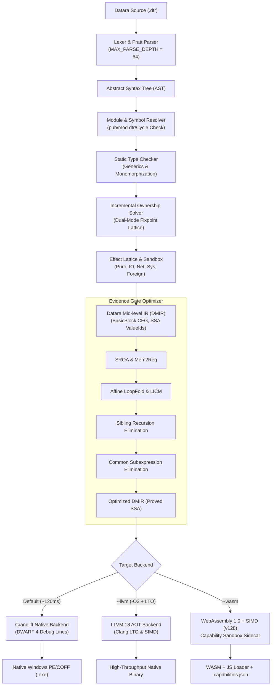
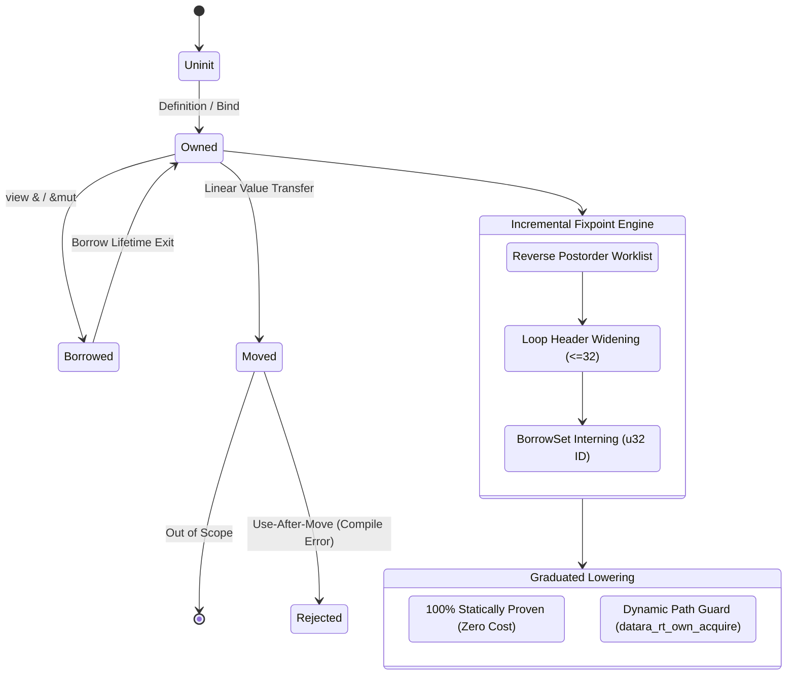
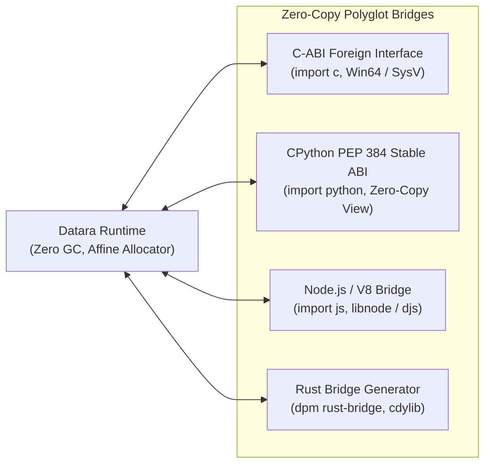

# CURRENT ARCHITECTURE — FORGEN COMPILER TOOLCHAIN

**Language:** Datara (`.dtr`)  
**Compiler:** Forgen  
**Status:** Verified subset plus explicit implementation gaps

## 1. Actual native path

The canonical concept documents additionally require HIR, a complete semantic graph/dataflow boundary, full specialization, runtime PGO, and broader effect/ownership proofs. Those are architectural targets, not all verified current components.

## 2. Verified boundaries

### Frontend & Modular System

The lexer rejects unsupported characters rather than dropping them. The parser and lowering support the tested Datara subset, including functions, classes, traits with inherent/trait `impl` blocks, generic trait bounds with compile-time monomorphization, control flow, short-circuit `&&`/`||`, and explicit visibility (`pub`, private-by-default, `error[E0042]`, circular import cycle rejection, and directory package `mod.dtr` resolution).

### DMIR, CFG and Proof-Carrying Scheduler (PCS)

DMIR uses SSA-like `ValueId`s, basic blocks, and explicit terminators. Natural-loop and dominance analysis are available. 
The Proof-Carrying Scheduler (`src/schedule/`, `src/runtime/datara_rt_scheduler.c`, `tests/test_schedule_proof.rs`) precomputes serializable execution DAGs with Kahn topological wavefronts. Member tasks (`Class.method` $\leftrightarrow$ `Class_method`) are deduplicated through canonical name normalization. Deterministic CPU subgraphs execute via flat multi-core wavefront loops (`datara_rt_parallel_for`) with zero critical-path mutex pushes (`g_sched_mutex_queue_pushes == 0`). Dynamic subgraphs fall back to cooperative ready queues with thread-safe cancellation using one-time initialization (`InitOnceExecuteOnce` on Win32, `pthread_once` on POSIX).

### Optimizer & Ownership Fixpoint Engine

Verified transformations include constant folding, dead-code elimination, inlining, conservative local CSE, CFG LICM, non-escaping aggregate scalarization (SROA), and closed-form loop folding.
The Dual-Mode Ownership Fixpoint (`src/ownership/abstract.rs`) evaluates a 4-state abstract lattice $\{Uninit, Owned, Moved, Borrowed, Unknown\}$ with forward dataflow (must-analysis for moves, may-analysis for borrows) and loop header widening (capped at 32 iterations).

- **Dense Dataflow Architecture**: Optimized with reverse postorder (RPO) worklist evaluation ensuring forward topological traversal, dense variable and value state indexing (`DenseVarState`, `DenseFunctionDataflowState`), and hash-consed borrow sets via `BorrowSetInterner` (mapping borrow sets to compact `u32` IDs with $O(1)$ equality comparisons).
- **Hot-Path Zero Allocation**: Diagnostic emission and variable state snapshotting are strictly deferred to a single post-convergence pass, completely eliminating map lookups and allocations in the fixpoint loop while preserving 100% bit-for-bit diagnostic fidelity.
- **Graduated Lowering**: Definite use-after-move is rejected at compile time; dynamic paths emit unified runtime ownership guards (`datara_rt_own_acquire`/`datara_rt_own_release`) consistently lowered across Cranelift, LLVM, and WebAssembly targets.

### Frontend & Pratt Precedence-Climbing Parser

The parser (`src/parser/mod.rs`) utilizes an iterative Pratt precedence-climbing engine (`parse_binary_climbing`) replacing deep recursive-descent call ladders.
- Large AST node builder expressions (`parse_decide_expr`, `parse_match_expr`, `parse_select_expr`, etc.) are partitioned into `#[inline(never)]` helper methods, reducing debug stack frames from ~2 KB to ~48 bytes.
- Maximum recursion depth is raised from 16 to 64 (`MAX_PARSE_DEPTH = 64`), safely handling deeply nested expressions without thread stack exhaustion.

### Multi-Target Codegen (Cranelift, LLVM, WebAssembly)

- **Cranelift Backend**: Lowers DMIR blocks to native machine code. Emits full DWARF 4 line & debug information (`.debug_line`, `.debug_info`, `.debug_abbrev`, `.debug_str`) mapping statement spans to machine code offsets for GDB/LLDB/WinDbg source-level debugging.
- **LLVM Backend (`--llvm`)**: Generates optimized LLVM IR with target-triple specification, lowering `@datara_rt_own_acquire` and `@datara_rt_own_release` for parity with native runtime semantics.
- **Capability-Native WebAssembly Backend (`--wasm`)**: Compiles DMIR SSA block parameters directly into WebAssembly 1.0 stack parameters without phi elimination. Includes hardware SIMD (`v128`), dynamic ownership guard symbols (`datara_rt_own_acquire`/`datara_rt_own_release`), capability-checked JavaScript runtime shims, and `.capabilities.json` sidecar generation.

### Tooling, Package Registry & Rust Bridge

- **`dpm` Package Manager**: Provides production package management: HTTP/tarball archive fetching, SHA-256 integrity verification against manifest digests, cryptographic tamper rejection, pinned `datara.lock` generation/restoration, and air-gapped `--offline` caching.
- **`dpm rust-bridge <crate> --api manifest.toml`**: Automatic FFI bridge generator wrapping arbitrary Rust crates (`regex`, `serde_json`, `image`, etc.) with `std::panic::catch_unwind` safety boundaries, compiling `cdylib`/`staticlib` artifacts, and emitting type-safe `.dtr` Datara and `.h` C headers.

### Polyglot Interoperability & System Embed API (Wave 5)

- **C-ABI FFI (`tests/test_cimport_abi.rs`)**: Direct bidirectional C interop with struct passing, natural alignment padding, and bidirectional callbacks across MSVC x64 and System V ABI.
- **Python First-Class Bridge (`tests/test_cpython_bridge.rs`)**: Embeds CPython 3.12+ with `py_eval`, `py_call`, and zero-copy NumPy buffer sharing (`DataraMemoryView`).
- **WebAssembly & JS World (`tests/test_node_bridge.rs`, `tests/test_wasm_showcase.rs`)**: Lowers directly to WebAssembly with JS DOM bridges and capability-native runtime shims.
- **Embed C API (`libforgen`, `tests/test_c_embed_api.rs`)**: Exposes `forgen_compiler_new`, `forgen_compile_string`, `forgen_result_free`, etc. as a standard C dynamic/static library (`libforgen.dll` / `libforgen.so`).
- **Deterministic Lockstep Simulation (`examples/showcase/lockstep_sim/`, `tests/test_lockstep_sim.rs`)**: 10,000 game ticks with multi-core `parallel for` and hardware SIMD producing bit-for-bit identical checksums across 4 independent runs.

## 3. Required pass contract

Each transformation intended for `Applied` status must document:

1. preconditions;
2. analysis and proof facts;
3. DMIR/CFG transformation;
4. postconditions and verifier;
5. effect/trap/ABI preservation;
6. cost estimate;
7. explanation and structural evidence.

## 4. Continuous Integration, Benchmarks & Quality (Wave 6)

- **Normative Conformance Suite (84 / 84 PASS)**: `tests/test_conformance_suite.rs` validates 100% compliance across all 13 normative gates of [`docs/SPEC_V1.md`](docs/SPEC_V1.md) (see [`docs/CONFORMANCE_MATRIX.md`](docs/CONFORMANCE_MATRIX.md)).
- **Zero Stubs Policy**: Strict 0 TODO, 0 FIXME, and 0 unmapped call count across the entire `src/` codebase.
- **148 Test Targets / 668 Passing Tests**: Full regression, verification, differential cross-backend execution, and end-to-end integration coverage with 0 test failures. 7 long-running multi-language stress benchmarks are ignored by default and executed on demand (`cargo test -- --ignored`).
- **Hardware-Measured Performance Report**: Complete automated provenance and benchmark suite in [`docs/PERFORMANCE.md`](PERFORMANCE.md) with 7 datasets in [`docs/data/`](data/) covering AOT compile times, runtime workloads, JSON parsing, ownership proof distribution, and deterministic lockstep simulation.
- **Differential Cross-Backend Testing**: Dedicated 10-program differential suite (`tests/test_backend_differential.rs`) executing identically across Cranelift, WebAssembly (via Node.js), and LLVM.
- **Criterion Phase Benchmarks**: Comprehensive micro-benchmarks (`benches/compiler_phases.rs`) tracking latencies for Lexer, Parser, Typecheck, Ownership Dataflow, Cranelift, and WASM phases (see [`docs/BASELINES.md`](docs/BASELINES.md)).
- **MSRV Verification**: Minimum Supported Rust Version pinned to `1.85.0` (2024 edition compatible).
- **AddressSanitizer (ASan) & WASM Runtime Jobs**: Dedicated `.github/workflows/ci.yml` CI jobs verifying memory safety under `-fsanitize=address` and automated headless WebAssembly execution.

This file describes the verified compiler implementation and toolchain architecture through Wave 6 completion.

