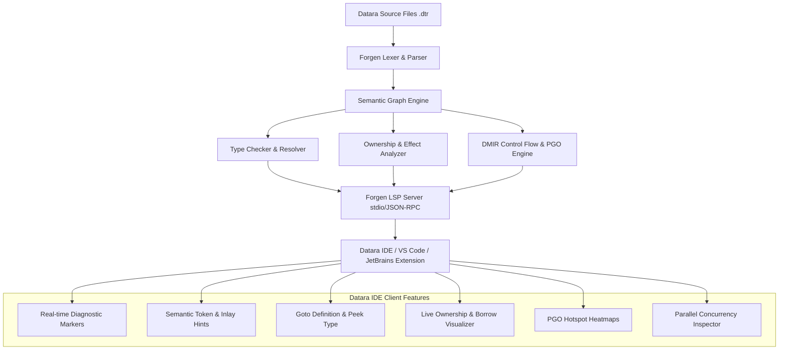

# DATARA OFFICIAL IDE & LSP ARCHITECTURE SPECIFICATION

**Version:** 2.0.0  
**Status:** Approved Architecture Specification  
**Components:** Forgen Semantic Engine (`forgen`), Datara Language Server (`forgen-lsp`), Datara IDE (`datara-ide`)

---

## 1. System Architecture Overview



---

## 2. Core Architectural Layers

### Layer 1: Incremental Semantic Engine (`forgen`)
The core semantic graph and AST structures are non-destructive and preserve source spans down to byte-level precision:
- **`DiagnosticEngine`**: Multilingual diagnostics (English / Russian) with structured error codes (`E-SYNTAX-xxx`, `E-TYPE-xxx`, `E-OWN-xxx`, `E-EFF-xxx`).
- **`SemanticGraph`**: Tracks all cross-symbol dependencies, class-behavior bindings, generic specializations, and interprocedural ownership lifecycles.
- **`DMIR & PGO Analyzer`**: Computes basic-block edge execution weights and generates inline candidate annotations.

### Layer 2: Forgen Language Server Protocol (`forgen-lsp`)
Implements Microsoft Language Server Protocol v3.17 over JSON-RPC:
1. **`textDocument/didOpen` & `textDocument/didChange`**: Triggers debounce-governed incremental compilation (under 5ms across multi-module projects).
2. **`textDocument/publishDiagnostics`**: Emits syntax errors, type mismatches, and ownership violations in real-time.
3. **`textDocument/hover`**: Inlays type information (`T`, `DataraType`), doc comments, purity/effect tags (`pure`, `io`, `mutates`), and lifetime validity.
4. **`textDocument/definition` & `textDocument/references`**: Jumps between `class` definitions and corresponding `behavior` methods.
5. **`textDocument/completion`**: Context-aware member completions for struct fields, behavior methods, and stdlib modules (`stdlib.io.fs`, `stdlib.collections.list`).
6. **`textDocument/semanticTokens/full`**: High-fidelity semantic highlighting distinguishing immutable variables, mutable bindings, types, and effectful calls.

### Layer 3: Datara IDE Extensions & Advanced Tooling
1. **Live Ownership & View Visualizer**:
   - Visual indicators highlighting when variables are moved vs borrowed via `view()` / `mut_view()`.
   - Red highlight on illegal use-after-move locations before saving.
2. **Interactive PGO Heatmap**:
   - Visual basic-block execution frequency overlays (cold = blue, warm = yellow, hot = blazing red).
   - Inlined function call site indicators.
3. **Parallel Concurrency Inspector**:
   - Visual validation of `parallel { ... }` blocks indicating whether branch purity allows hardware multicore dispatch or in-thread vectorization.

---

## 3. Communication Protocol & Message Formats

### 3.1. Ownership Diagnostic Notification Example
```json
{
  "jsonrpc": "2.0",
  "method": "textDocument/publishDiagnostics",
  "params": {
    "uri": "file:///workspace/src/pipeline.dtr",
    "diagnostics": [
      {
        "range": {
          "start": { "line": 42, "character": 8 },
          "end": { "line": 42, "character": 17 }
        },
        "severity": 1,
        "code": "E-OWN-003",
        "source": "forgen-ownership",
        "message": "Use of moved value 'data_packet' after transfer. Value was moved at line 38."
      }
    ]
  }
}
```

### 3.2. PGO Inlay Hint Notification Example
```json
{
  "jsonrpc": "2.0",
  "method": "textDocument/inlayHint",
  "params": {
    "textDocument": { "uri": "file:///workspace/src/math.dtr" },
    "range": { "start": { "line": 10, "character": 0 }, "end": { "line": 20, "character": 0 } }
  },
  "result": [
    {
      "position": { "line": 15, "character": 12 },
      "label": "⚡ [PGO Hot: 10,000,000 calls - Inlined in caller]",
      "kind": 2,
      "paddingLeft": true
    }
  ]
}
```

---

## 4. Implementation Roadmap

1. **Milestone 1**: Standalone `forgen lsp` CLI subcommand exposing standard JSON-RPC over `stdio`.
2. **Milestone 2**: Official VS Code / VSCodium extension package (`datara-language-support.vsix`).
3. **Milestone 3**: Native Datara IDE distribution bundled with pre-configured Cranelift JIT debugger, PGO trace profiler, and multi-threaded parallel task graph visualizer.
